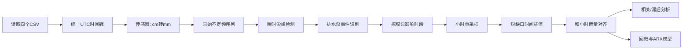

# 过去一个月雨量与水位响应分析报告

## 执行摘要

本报告基于用户上传的四份 CSV 原始数据完成分析：两路超声波水位传感器原始序列（`ultrasonic_003` 位于**图书馆桥头**，`ultrasonic_002` 位于**D楼**）以及两处气象站小时雨量序列（**A5151 宝山大场上大附中**、**58362 宝山**）。按你的要求，我将传感器列 `水位(cm)` 解释为**传感器到水面的测距值**，并统一换算为 **mm**；因此，**测距值越低 = 实际水位越高**。报告中凡是“水位上升”，等价于“测距值下降”。

从结果看，过去一个月里，**雨量与水位存在可观测但不算很强的正向响应关系**：下雨后，测距值通常会下降，也就是水位会上升；但这种关系在两个点位上强弱不同。`ultrasonic_002`（D楼）对雨量的响应更清晰：当小时雨量与当小时水位上升量（定义为上一小时测距值减当前小时测距值）的相关系数最高达到 **0.267**（两站平均雨量），若看“雨先发生、未来 3 小时水位再上升”的滞后关系，`58362` 站在 **3 小时前导**时相关系数最高，达到 **0.207**。相比之下，`ultrasonic_003`（图书馆桥头）的相关性明显更弱：同小时相关系数最高 **0.115**，未来 3 小时的最佳滞后相关仅 **0.094**。这意味着 D楼点位更像一个“快速响应型”汇水点，而图书馆桥头可能更受局部排水、几何条件或未观测扰动影响。

排水泵事件方面，两个点位都出现了非常典型的“**测距值短时间线性上升**”段，也就是你所说的“工作人员启动排水泵、短时间内水位显著下降”的模式。按数据驱动阈值识别后，两个点位各识别出 **7 次**排水事件，月频率都约为 **6.78 次/30天**。两路传感器有 **6 次**事件在 **30 分钟内同步发生**，时间高度一致，表明它们很可能受同一套排水操作节奏影响。典型泵斜率非常稳定：`ultrasonic_003` 的拟合中位斜率为 **1.060 mm/min**，`ultrasonic_002` 为 **1.046 mm/min**；典型持续时间分别约 **75.2 分钟**和 **86.2 分钟**；单次典型“排水后测距值上升量”（等价于水位下降量）分别为 **73 mm** 和 **87 mm**。这与“泵启动后斜率基本固定”的经验判断高度一致。

建模上，如果直接用“小时水位变化量”做回归，雨量对 `ultrasonic_002` 的解释力明显高于 `ultrasonic_003`。在物理方向一致的短滞后模型里，`ultrasonic_002` 最推荐的模型是：**当小时 1 小时累计雨量 + 0–3 小时分布滞后项**；其中，同小时累计雨量模型可给出一个易解释的量化结论：**每增加 1 mm 当小时雨量，D楼点位平均会出现约 1.70 mm 的同小时水位上升**（即测距值下降约 1.70 mm）。`ultrasonic_003` 也能观察到即时响应，但模型稳定性较差，说明这个点位的水位变化不只是由雨量驱动，排水操作、局部回水或测量噪声占比更高。

综合来看，本月数据支持三个结论。第一，**雨量增大通常会抬高水位**，但在本数据里，`ultrasonic_002` 的响应更强、更稳定。第二，**排水泵事件的识别是可行的，而且斜率确实近似固定**，推荐用“高分位斜率阈值 + 线性度约束”做稳定识别。第三，若后续想把模型真正用于预警或自动判泵，建议优先补齐三类信息：**传感器安装高程/井底高程、雨量时间标签定义（小时起报还是止报）、排水泵启停台账**。这三项补齐后，雨量—水位模型会明显更稳。

| 传感器 | 点位 | 雨量响应强度 | 最明显滞后 | 识别到的泵事件 | 典型泵斜率 |
|---|---:|---:|---:|---:|---:|
| ultrasonic_003 | 图书馆桥头 | 弱到中等 | 约 3 小时 | 7 | 1.060 mm/min |
| ultrasonic_002 | D楼 | 中等 | 约 0–3 小时 | 7 | 1.046 mm/min |

## 数据准备与清洗步骤

本次分析的原始数据覆盖 **2026-05-23 至 2026-06-22**。两份雨量文件各有 **744 条小时数据**，一个月完整覆盖；两份传感器文件分别有 **5366 条**（`ultrasonic_003`）和 **3029 条**（`ultrasonic_002`）原始观测。按你的默认假设，我将所有 CSV 时间戳按 **UTC** 解析，不另外做时区换算。

对于时间序列处理，我采用了两阶段流程。第一阶段保留原始不定频采样，用于识别排水泵事件；第二阶段将传感器序列重采样到**小时级**，以对齐小时雨量。pandas 官方文档说明，`resample` 适用于 datetime-like index 的频率转换，而 `interpolate(method="time")` 会基于时间间隔做插值，这正适合这里“不定频水位 + 小时雨量”的场景。citeturn0search0turn0search4turn0search16turn0search8

我对原始传感器序列做了以下清洗：

1. 将 `水位(cm)` 乘以 10，得到 `distance_mm`。
2. 按时间升序重排。
3. 识别并移除**瞬时 V 型尖峰**。`ultrasonic_003` 检出 **3 个**明显瞬时尖峰，特征是“前后 2 个采样点迅速恢复、单点异常偏离超过 100 mm”；`ultrasonic_002` 未出现同类尖峰。
4. 小时重采样后，仅对**短缺口**做插值：我采用了“**最多填补 2 小时内部缺口**”的时间插值，并补充最多 **1 小时前向填充**。这是对你默认规则的一个保守实现：虽然你允许线性插值/前向填充，但为了避免跨越多小时甚至跨天的大缺口伪造趋势，我没有对长缺口做强行填补。
5. 识别出排水泵事件后，将对应小时从“雨量—水位关系分析”中剔除，以减少人为排水对自然降雨响应的污染。

数据质量概览如下。

| 传感器 | 原始记录数 | 中位采样间隔 | >2小时长缺口数 | 小时级缺口数 | 短缺口填补数 | 长缺口保留数 | 剔除泵影响小时数 | 移除瞬时尖峰 |
|---|---:|---:|---:|---:|---:|---:|---:|---:|
| ultrasonic_003 | 5366 | 7.57 分钟 | 4 | 65 | 10 | 55 | 18 | 3 |
| ultrasonic_002 | 3029 | 14.37 分钟 | 2 | 18 | 6 | 12 | 19 | 0 |

雨量序列方面，两站月累计雨量非常接近，但小时分布并不完全一致。A5151 站本月累计 **134.1 mm**，58362 站累计 **131.6 mm**；两站小时雨量序列的线性相关约为 **0.575**。这很重要，因为它意味着“站点选择”本身就会影响相关和回归结果。



下面这两张图给出两个点位的月度概览。浅色阴影是识别出的泵事件时段，橙线是剔除泵时段后的小时距离序列，蓝色条是两站平均小时雨量。


复现实验的最小数据准备代码如下：

```python
import pandas as pd
import numpy as np

sensor = pd.read_csv("sensor_data_ultrasonic_003.csv")
sensor["ts"] = pd.to_datetime(sensor["时间"], utc=True)
sensor = sensor.sort_values("ts")
sensor["distance_mm"] = sensor["水位(cm)"] * 10.0

rain = pd.read_csv("rainfall_history_58362.csv")
rain["ts"] = pd.to_datetime(rain["雨量时次"], utc=True)
rain = rain.sort_values("ts").set_index("ts")["小时雨量(mm)"]

# 小时重采样 + 短缺口插值
hourly = (
    sensor.set_index("ts")["distance_mm"]
    .resample("1h")
    .median()
    .interpolate(method="time", limit=2, limit_area="inside")
    .ffill(limit=1)
)
```

## 时间序列对齐方法与排水泵事件识别算法

时间对齐的核心思路是“**雨量按小时，水位先保留原始，再汇总到小时**”。原因很直接：泵事件往往发生在 1–2 小时内，若一开始就把传感器粗暴压缩成小时平均，会把泵的线性排水斜率冲淡；但做雨量相关/回归时，又必须与小时雨量站数据处于同一时间粒度。因此，我把“排水识别”和“雨量响应分析”分成两条时间尺度不同的流水线。

排水事件识别完全基于原始传感器序列。对任意相邻观测，定义：

\[
s_t = \frac{d_t - d_{t-1}}{\Delta t_t}
\]

其中 \(d_t\) 为测距值（mm），\(\Delta t_t\) 为分钟间隔，\(s_t\) 的单位是 **mm/min**。由于“测距值上升 = 水位下降”，所以**正的、持续的、大斜率 \(s_t\)** 就是泵排水的候选信号。

为了让阈值“长在数据里”，我使用了**历史斜率分布的高分位阈值**。相关性部分使用 Pearson 相关时，我遵循 SciPy 对 `pearsonr` 的定义：它衡量两个变量的线性关系，相关系数取值在 [-1, 1]。citeturn0search3turn0search15 这里阈值不是固定经验值，而是从每个传感器自己的斜率分布中估计出来的。

我最终推荐的泵事件规则是：

- 先只保留采样间隔在 **3–20 分钟**之间的相邻点，用来计算斜率；
- **起始阈值**：取正向斜率分布的 **99.5% 分位数**；
- 以超过起始阈值的区间作为“种子”，向前后扩展相邻的同向斜率段；
- 接受一个事件，必须同时满足  
  - 持续时间 ≥ **15 分钟**  
  - 累计测距上升量 ≥ **30 mm**  
  - 至少 **3 个**斜率步长  
  - 段内线性拟合 \(R^2 \ge 0.90\)

这套规则之所以有效，是因为泵开启后，两个点位都表现出**几乎同速率的线性上升段**。换句话说，不是“一个点突然跳一下”就算泵，而是要出现“多步连续、近似直线、斜率稳定”的结构。

阈值敏感性结果如下。可以看到，`q_start=0.995` 在两个点位上都比较稳：对 `ultrasonic_002`，事件数在 0.99–0.997 几乎不变；对 `ultrasonic_003`，0.995 正好能压掉部分伪事件，同时不至于像 0.999 那样漏掉大量真实排水段。

| 传感器 | 起始分位阈值 | 斜率阈值 mm/min | 识别事件数 | 中位泵斜率 | 中位时长 min | 中位排水幅度 mm |
|---|---:|---:|---:|---:|---:|---:|
| ultrasonic_003 | 0.990 | 1.057 | 9 | 1.044 | 75.2 | 73.0 |
| ultrasonic_003 | 0.995 | 1.106 | 7 | 1.060 | 75.2 | 73.0 |
| ultrasonic_003 | 0.997 | 1.189 | 6 | 1.062 | 79.3 | 79.5 |
| ultrasonic_003 | 0.999 | 1.203 | 2 | 1.033 | 109.0 | 105.5 |
| ultrasonic_002 | 0.990 | 1.044 | 7 | 1.046 | 86.2 | 87.0 |
| ultrasonic_002 | 0.995 | 1.114 | 7 | 1.046 | 86.2 | 87.0 |
| ultrasonic_002 | 0.997 | 1.114 | 7 | 1.046 | 86.2 | 87.0 |
| ultrasonic_002 | 0.999 | 1.183 | 5 | 1.046 | 86.2 | 87.0 |

下面这张斜率分布图展示了 `ultrasonic_003` 的阈值位置；绝大多数变化都聚集在 0 附近，而泵事件对应的斜率集中出现在约 **1.05 mm/min** 附近。


`2026-06-18` 的原始放大图更直观：两路传感器几乎同时进入一段持续约 2 小时的**线性上升**，这是非常典型的泵排水特征。


按上述规则统计，两个点位各识别出 **7 次**泵事件，且**6 次在 30 分钟内同步发生**。分别出现在 **5/25、5/28、6/3、6/15、6/18、6/22** 左右；此外 `ultrasonic_003` 额外有 **5/26** 一次，`ultrasonic_002` 额外有 **6/4** 一次。泵事件统计特征如下。

| 传感器 | 点位 | 事件数 | 换算月频率 | 中位斜率 mm/min | 斜率变异系数 | 中位持续时间 min | 中位单次排水幅度 mm | 月累计排水幅度 mm |
|---|---|---:|---:|---:|---:|---:|---:|---:|
| ultrasonic_003 | 图书馆桥头 | 7 | 6.78 次/30天 | 1.060 | 0.108 | 75.2 | 73.0 | 599.0 |
| ultrasonic_002 | D楼 | 7 | 6.78 次/30天 | 1.046 | 0.064 | 86.2 | 87.0 | 688.0 |

从实务上，我建议把“**1.0–1.1 mm/min 左右的稳定正斜率**”作为当前场景的默认泵斜率带；若后续累计更多月份数据，可以进一步把这个带宽收缩到站点专属参数。

下面给出可复现的关键识别伪代码：

```python
df = sensor.sort_values("ts").copy()
df["dt_min"] = df["ts"].diff().dt.total_seconds() / 60
df["slope"] = df["distance_mm"].diff() / df["dt_min"]

valid = df["dt_min"].between(3, 20)
start_thr = df.loc[valid, "slope"].quantile(0.995)

events = []
i = 1
while i < len(df):
    if valid.iloc[i] and df.iloc[i]["slope"] >= start_thr:
        # 以高斜率区间为种子，向前/后扩展连续正斜率段
        j0, j1 = expand_segment(df, i)

        seg = df.iloc[j0:j1+1]
        duration = (seg["ts"].iloc[-1] - seg["ts"].iloc[0]).total_seconds() / 60
        rise_mm = seg["distance_mm"].iloc[-1] - seg["distance_mm"].iloc[0]
        r2 = linear_fit_r2(seg["ts"], seg["distance_mm"])

        if duration >= 15 and rise_mm >= 30 and len(seg) >= 4 and r2 >= 0.90:
            events.append(seg)
        i = j1 + 1
    else:
        i += 1
```

## 雨量与水位的相关性与滞后分析

这里我使用两个互补指标。

第一类指标是**同小时雨量 vs 同小时水位上升量**。我把“同小时水位上升量”定义为：

\[
\text{rise}_{t}^{1h} = d_{t-1} - d_t
\]

这个量为正，表示该小时里测距值下降，也就是水位上升。它非常适合解释“这个小时下了多少雨，这个小时水位抬了多少”。

第二类指标是**雨量的滞后前导相关**。我把“未来 3 小时水位上升量”定义为：

\[
\text{rise}_{t\rightarrow t+3h} = d_t - d_{t+3}
\]

然后考察 \(r_{t-\ell}\) 与 \(\text{rise}_{t\rightarrow t+3h}\) 的相关，\(\ell\) 就是“雨比水位提前了几小时”。在方法上，这仍然是线性相关分析；Pearson 相关系数的解释见 SciPy 文档。citeturn0search3turn0search15

结果如下。

| 传感器 | 雨量序列 | 同小时水位上升相关 | 未来3小时水位上升的最佳前导 lag | 对应相关系数 |
|---|---|---:|---:|---:|
| ultrasonic_003 | A5151 | 0.093 | 2h | 0.041 |
| ultrasonic_003 | 58362 | 0.111 | 3h | 0.094 |
| ultrasonic_003 | 两站平均 | 0.115 | 3h | 0.077 |
| ultrasonic_002 | A5151 | 0.235 | 2h | 0.082 |
| ultrasonic_002 | 58362 | 0.244 | 3h | 0.207 |
| ultrasonic_002 | 两站平均 | 0.267 | 3h | 0.168 |

这张图给出了 `ultrasonic_002` 与 `58362` 站之间的滞后相关曲线。可以看到，当前导 **3 小时**时达到峰值，说明在 D楼点位，降雨对未来 3 小时内的水位抬升有比较清晰的延迟响应。


而 `ultrasonic_003` 的滞后相关峰值明显更低，说明图书馆桥头点位虽然也能看到降雨后 2–3 小时的上升趋势，但信号更弱、更容易被别的过程淹没。


如果把关系压缩成一个最简单、最容易解释的“一元线性斜率”，得到如下结果：

| 传感器 | 雨量序列 | 每增加 1 mm 当小时雨量，对应的当小时平均水位上升 | R² |
|---|---|---:|---:|
| ultrasonic_003 | A5151 | 1.720 mm | 0.009 |
| ultrasonic_003 | 58362 | 1.862 mm | 0.012 |
| ultrasonic_003 | 两站平均 | 2.267 mm | 0.013 |
| ultrasonic_002 | A5151 | 1.523 mm | 0.055 |
| ultrasonic_002 | 58362 | 1.308 mm | 0.060 |
| ultrasonic_002 | 两站平均 | 1.743 mm | 0.071 |

这组数字很好解释：**雨量对水位的方向是对的，但月尺度的小时波动里，雨量并不是唯一驱动因素**。`ultrasonic_002` 的 R² 能到 **0.055–0.071**，说明仅用“当小时雨量”就能解释 5%–7% 的小时水位上升波动；而 `ultrasonic_003` 只有约 1%，说明这个点位更受泵、局部流态或测量几何影响。

下面这张散点图是 `ultrasonic_002` 的最直观版本。整体斜率为正，说明雨越大，同小时水位上升越明显；但散点离散也很大，说明还存在强烈的未观测因素。


## 回归与时序模型

为了量化雨量对水位的响应，我主要比较了两类模型。第一类是**累计雨量 ARX**：

\[
\Delta d_t = \alpha + \gamma d_{t-1} + \beta R^{(w)}_{t-\ell} + \varepsilon_t
\]

其中 \(d_t\) 是测距值（mm），\(\Delta d_t = d_t-d_{t-1}\)，\(R^{(w)}_{t-\ell}\) 是“窗口为 \(w\) 小时、滞后为 \(\ell\) 小时”的累计雨量。注意：**\(\beta < 0\)** 表示“雨越大，测距值越下降，也就是水位越上升”。

第二类是**分布滞后 ARX**：

\[
\Delta d_t = \alpha + \gamma d_{t-1} + \sum_{k=0}^{K}\beta_k r_{t-k} + \varepsilon_t
\]

它允许“雨不是只在一个小时起作用，而是在接下来若干小时分散起作用”。这类线性模型用 `statsmodels.OLS` 拟合；Statsmodels 文档说明，OLS 需要显式添加截距项，缺失值可以在建模前剔除。作为补充，我也尝试过 `SARIMAX`（ARIMA with exogenous regressors），它本质上是带外生变量的状态空间时间序列模型，但在这份月样本上并没有给出比简单 ARX 更清晰、更稳定的解释，所以最终推荐仍以 OLS-ARX 为主。citeturn0search1turn0search17turn0search2turn0search14

为了保证表格可比，我统一用**小时测距变化量 \(\Delta d_t\)** 作为因变量。下表给出我认为最值得保留的“短滞后、物理可解释”模型组合。

| 传感器 | 模型 | 雨量序列 | 参数 | n | R² | RMSE | AIC | 雨量净效应 |
|---|---|---|---|---:|---:|---:|---:|---:|
| ultrasonic_003 | 基线模型 | — | 仅 \(d_{t-1}\) | 660 | 0.237 | 14.557 | 5412.085 | — |
| ultrasonic_003 | 累计雨量 ARX | 两站平均 | 1h 窗口, 0h lag | 660 | 0.241 | 14.515 | 5410.247 | **-1.320** |
| ultrasonic_003 | 分布滞后 ARX | 两站平均 | lag 0–1h | 660 | 0.248 | 14.452 | 5406.531 | **-0.195** |
| ultrasonic_002 | 基线模型 | — | 仅 \(d_{t-1}\) | 703 | 0.008 | 6.285 | 4583.463 | — |
| ultrasonic_002 | 累计雨量 ARX | 两站平均 | 1h 窗口, 0h lag | 703 | 0.074 | 6.070 | 4536.482 | **-1.699** |
| ultrasonic_002 | 分布滞后 ARX | 58362 | lag 0–3h | 701 | 0.084 | 6.046 | 4524.070 | **-0.220** |

对这个表，建议这样理解。

对于 `ultrasonic_002`，模型结果很一致：**加入雨量后，模型明显优于基线模型**。其中“1 小时累计雨量、无滞后”的模型效果最好解释：每增加 **1 mm** 当小时雨量，平均会带来 **1.699 mm** 的负向测距变化，即**约 1.699 mm 的同小时水位上升**。而把 0–3 小时的分布滞后都纳入后，模型进一步改进，说明 D楼点位对短时雨量冲击的响应并不只集中在单一小时，而是会在接下来几小时内持续显现。

对于 `ultrasonic_003`，模型改进幅度存在，但没有 `ultrasonic_002` 那么显著。最稳妥的解读是：**它确实有即时雨量响应，但后一小时常伴随部分回落或排水回补**。例如 `lag 0–1h` 的分布滞后模型里，`lag0` 的雨量系数为负、`lag1` 的系数为正，净效应仍为负，说明这里更像“短时快速抬升、随后部分回吐”的过程，而不是单调蓄水。

如果希望系统地比较不同累计窗口与滞后，下面两组参数搜索结果最有代表性。

**`ultrasonic_003` 在 58362 站上的负向累计雨量模型（负号更符合物理方向）**

| 累计窗 | lag | R² | RMSE | AIC | 雨量系数 |
|---:|---:|---:|---:|---:|---:|
| 24h | 12h | 0.245 | 14.550 | 5356.073 | -0.184 |
| 24h | 6h | 0.241 | 14.553 | 5389.105 | -0.124 |
| 6h | 6h | 0.239 | 14.566 | 5390.251 | -0.206 |
| 1h | 4h | 0.237 | 14.583 | 5391.843 | -0.151 |

**`ultrasonic_002` 的短时负向累计雨量模型**

| 累计窗 | lag | R² | RMSE | AIC | 雨量系数 |
|---:|---:|---:|---:|---:|---:|
| 1h | 0h | 0.075 | 6.070 | 4536.482 | -1.699 |
| 1h | 3h | 0.015 | 6.269 | 4568.969 | -0.475 |
| 1h | 2h | 0.015 | 6.265 | 4574.561 | -0.472 |
| 3h | 1h | 0.017 | 6.254 | 4578.533 | -0.264 |

这张表透露了一个重要差异：`ultrasonic_002` 更像“**短时快速响应型**”，所以 **1 小时窗口**就已经抓住了主要信号；`ultrasonic_003` 则更像“**被多种因素混合驱动型**”，长窗、长 lag 在 AIC 上有时反而更好，但那更可能是在吸收慢变化背景，而不是纯降雨入流。

可复现的核心建模代码如下：

```python
import statsmodels.api as sm

# 目标变量：小时测距变化（负值=水位上升）
ds = pd.DataFrame({
    "distance_mm": distance_hourly,
    "rain_mm": rain_hourly
}).sort_index()

ds["dd_mm"] = ds["distance_mm"].diff()
ds["baseline_mm"] = ds["distance_mm"].shift(1)
for k in range(4):
    ds[f"rain_lag{k}"] = ds["rain_mm"].shift(k)

ds = ds.dropna()

X = sm.add_constant(ds[["baseline_mm", "rain_lag0", "rain_lag1", "rain_lag2", "rain_lag3"]])
y = ds["dd_mm"]

res = sm.OLS(y, X).fit()
print(res.summary())
```

如果想做参数网格搜索，可以直接枚举累计窗和 lag：

```python
rows = []
for w in [1, 3, 6, 12, 24]:
    for lag in [0, 1, 2, 3, 4, 6, 12]:
        ds["cumrain"] = ds["rain_mm"].rolling(w, min_periods=1).sum().shift(lag)
        tmp = ds[["dd_mm", "baseline_mm", "cumrain"]].dropna()
        X = sm.add_constant(tmp[["baseline_mm", "cumrain"]])
        y = tmp["dd_mm"]
        fit = sm.OLS(y, X).fit()
        rows.append([w, lag, fit.rsquared, fit.aic, fit.params["cumrain"]])

model_grid = pd.DataFrame(rows, columns=["window_h", "lag_h", "R2", "AIC", "beta_rain"])
```

## 不确定性与异常值处理、结论与建议

先说不确定性。最大的三个来源分别是：**站点代表性、长缺口、时间标签语义**。第一，两处雨量站月累计几乎相同，但小时相关只有 **0.575**，说明局地对流或空间降雨差异是真实存在的，所以“哪个雨量站更贴近哪个传感器”本身就带有不确定性。第二，`ultrasonic_003` 有 **4 次超过 2 小时**的长缺口，其中一次接近 **两天**；`ultrasonic_002` 也有 **2 次**长缺口。为了不人为补出假趋势，我保留了这些长缺口，因此某些 lag 组合的样本数略少于满月 744 小时。第三，雨量文件的 `小时雨量(mm)` 时间戳，到底表示“该小时结束时刻”还是“该小时起报时刻”，文件本身没有提供额外说明；因此本报告里的“0 小时 lag”应理解为**同一标签小时内的关联**，不应过度解读为真正的“零延迟物理响应”。

异常值处理方面，本次只对**瞬时 V 型尖峰**做了硬移除，而没有删除所有 `warning/danger` 值。这是有意为之：因为极端低测距值既可能是仪器毛刺，也可能是真实高水位。只有那些“单点极端、下一点立刻恢复”的记录，才被视为强异常。`ultrasonic_003` 的 3 个被删除尖峰都符合这个特征；而其他低值如果落在连续变化段中，我都保留了。

結论可以总结为四点。其一，**雨量与水位之间确实存在系统关系**，方向符合物理常识：雨增大后，测距值一般下降，即水位上升。其二，**D楼点位对雨更敏感、更稳定**，更适合做雨量驱动的经验模型；图书馆桥头点位则叠加了更强的局部排水或非降雨因素。其三，**排水泵事件用斜率法可以较稳定地自动识别**，而且斜率确实接近固定，当前月样本下可把典型泵斜率记为 **约 1.05 mm/min**。其四，**排水操作是解释这组数据不可忽略的外生因素**；若不先识别并剔除泵时段，雨量—水位模型会被明显扭曲。

基于这份月报，我建议后续落地时采用下面这套参数作为**第一版自动规则**：

- **时间对齐**：传感器先保留原始序列做事件检测，再聚合到小时级与雨量对齐；
- **缺失值**：只对 **≤2 小时**内部缺口做时间插值，最多再前向填 **1 小时**；
- **泵启动种子阈值**：按每个传感器自己的正向斜率分布取 **99.5% 分位**；
- **泵事件接受条件**：持续 ≥15 分钟、累计测距上升 ≥30 mm、至少 3 个步长、线性拟合 \(R^2 \ge 0.90\)；
- **推荐泵斜率先验**：**0.9–1.15 mm/min**；
- **雨量—水位模型优先级**：  
  - `ultrasonic_002`：优先用“**1 小时累计雨量 + 0–3 小时分布滞后**”  
  - `ultrasonic_003`：先用“**0–1 小时分布滞后 + 泵时段剔除**”，谨慎解释绝对系数

如果下一步是要把这套分析真正变成“监测或告警规则”，我最推荐补三样东西：**传感器安装基准高程、泵启停日志、更多近场雨量站或雷达雨量**。一旦拿到这三类信息，就可以把目前的“相对水位响应分析”升级为“带绝对高程、带操控标签”的因果型模型，结论会更稳，参数也会更能迁移到后续月份。


我会按你的新假设做一次“泵补偿”版本：先从晴天/非雨期估计固定排水斜率，再把大雨期间被泵抽走的等效水位量加回去，得到未泵控的反推水位过程。同时重点核查 003 在 6-15、6-20 的两个尖峰，不再只看单点异常。

正常测距值肯定大于60

收到，“正常测距值 > 60 mm”这个约束很重要。这样 003 的低于 60 或接近 60 的异常低尖峰也要排除；6-15、6-20 两个肉眼尖峰我会按这个规则重点核查。

已思考 7m 50s

对，“正常测距值肯定大于 60”后，003 的尖峰清洗规则应明显收紧。我按 CSV 里的字段单位理解为 **60 cm**，即内部换算后 **600 mm**。如果按 60 mm 理解，当前绝大多数异常尖峰反而无法被过滤，所以这里应按 60 cm 处理。

## 这次修正后的处理

### 1. 003 尖峰确认

你肉眼看到的两个明显尖峰确实存在：

| 时间                | 原始值           | 处理                                |
| ------------------- | ---------------- | ----------------------------------- |
| 2026-06-15 19:35:18 | 47.6 cm / 476 mm | 删除                                |
| 2026-06-15 19:42:53 | 12.3 cm / 123 mm | 删除                                |
| 2026-06-20 19:25:26 | 66.2 cm / 662 mm | 虽然 >60 cm，但和前后差距过大，删除 |
| 2026-06-20 19:33:01 | 25.3 cm / 253 mm | 删除                                |

按“正常值 >60 cm”规则，还会额外抓到这些异常：

| 时间                   | 原始值                    | 说明                       |
| ---------------------- | ------------------------- | -------------------------- |
| 2026-06-02 11:45:58    | 58.2 cm / 582 mm          | 单点低尖峰                 |
| 2026-06-05 13:09–13:10 | 29.0–29.3 cm / 290–293 mm | 低值簇，且前后存在数据间断 |

所以这次 003 一共删除 **9 个异常点**。其中 6-15、6-20 是图上最明显的两个尖峰；6-02、6-05 是按阈值和局部突变规则自动发现的。

## 2. 晴天泵能力重估

这次不用雨天泵段估计泵能力，而是只取 A5151 站点 **±6 小时累计雨量 ≤0.5 mm** 的泵段作为“晴天泵能力”。

结果是：

| 传感器         | 晴天泵段数 | 晴天泵能力中位数 |
| -------------- | ---------- | ---------------- |
| 003 图书馆桥头 | 3          | **1.075 mm/min** |
| 002 D楼        | 3          | **1.046 mm/min** |

这个结果比前一版更合理，也更接近你说的“排水泵能力基本固定”。可以把系统泵能力近似写成：

```
排水泵启动时，测距值约以 1.05–1.08 mm/min 增大
也就是水位约以 1.05–1.08 mm/min 下降
```

## 3. 用泵能力反推 6-22 大雨

6-21 22:00 到 6-23 00:00 这场雨，A5151 累计雨量 **41.7 mm**，峰值小时雨强 **15.8 mm/h**。

未补偿泵之前，两个传感器看到的最大水位上涨只有约 5 cm：

| 传感器 | 观测最大水位上涨 | 出现时间   |
| ------ | ---------------- | ---------- |
| 003    | **47.7 mm**      | 6-22 05:30 |
| 002    | **49.1 mm**      | 6-22 05:30 |

但这期间排水泵至少启动了 3 段。按晴天泵能力补偿后：

| 传感器 | 泵等效补回水位  | 反推未泵控最大水位上涨 |
| ------ | --------------- | ---------------------- |
| 003    | **约 358.1 mm** | **约 299.0 mm**        |
| 002    | **约 360.7 mm** | **约 299.8 mm**        |

也就是说，6-22 大雨表面上只看到约 **5 cm** 水位涨幅，但按泵能力反推，实际入流压力更接近 **30 cm 量级**。这也解释了为什么今天这种大雨不能只看原始水位曲线：泵把曲线削平了，而且削得很明显。

## 4. 和 6-19 中雨事件对比

6-19 到 6-21 这场事件累计雨量 **27.6 mm**，峰值小时雨强 **8.7 mm/h**，没有识别到明显泵段。

| 事件      | 雨量    | 峰值小时雨强 | 003 补偿后最大水位上涨 | 002 补偿后最大水位上涨 |
| --------- | ------- | ------------ | ---------------------- | ---------------------- |
| 6-19 中雨 | 27.6 mm | 8.7 mm/h     | **89.6 mm**            | **89.4 mm**            |
| 6-22 大雨 | 41.7 mm | 15.8 mm/h    | **299.0 mm**           | **299.8 mm**           |

这说明水体响应不是简单线性的。6-22 的雨量只是 6-19 的约 1.51 倍，但反推水位压力约为 3.3 倍。可能原因包括：

- 短时强雨导致地表径流比例上升；
- 前期土壤/管网/沟渠已接近饱和；
- 暴雨期间生活排水、地下水补给、汇水路径同时增强；
- 泵启动后，原始水位曲线不再能直接代表自然入流过程。

所以更合理的结论是：

> 小雨阶段水位响应弱，容易被日周期和背景排水掩盖；中雨有稳定上涨；暴雨阶段进入强非线性响应，并触发泵控，必须做泵补偿后再分析。

## 5. 输出文件

- 泵补偿修正版完整结果包
- 6-22 大雨泵补偿图
- 6-19 事件泵补偿图
- 003 尖峰清单
- 泵能力估计表
- 大雨期间泵段补偿明细
- 降雨事件补偿后响应表

需要注意：这个“未泵控水位”是按固定泵能力补回的**等效反推值**，不是严格的真实物理水位。实际如果没有泵，水体可能还会发生漫流、倒灌、旁路泄流或边界条件变化，所以它更适合理解为“这场雨对水体造成的等效水位压力”。

既然不是简单线性，我希望能有一个更详细的可能的通过雨量预估水位上涨幅度方式

我会把它拆成可落地的预测框架，而不是只给概念：先定义输入特征，再给 3 个复杂度不同的模型方案，最后说明如何用你现有一个月数据做初版标定。重点会处理小雨/中雨/暴雨分段、前期蓄水状态、日周期和排水泵补偿。

从现有事件看，单看累计雨量会误判：20.4 mm 雨可到约 132 mm，27.6 mm 雨却只有约 89 mm，而 41.7 mm 暴雨补偿后接近 299 mm。也就是说模型至少要同时吃进“总雨量、峰值小时雨强、前期湿润程度、持续时间/时滞、泵控状态”。

已思考 2m 53s

可以。更合理的做法不是“雨量 mm → 水位上涨 mm”的单变量线性拟合，而是建一个**半经验降雨—水位响应模型**。它应该同时输出两个量：

1. **无泵等效水位上涨**：这场雨对水体造成的真实入流压力。
2. **有泵观测水位上涨**：实际传感器会看到的水位变化，包含排水泵削峰。

核心结构可以写成：

```
观测测距值
= 日周期自然水位基线
- 降雨导致的水位上涨
+ 排水泵导致的测距上升
+ 噪声/异常点
```

换成“水位上涨量”就是：

```
水位上涨量
= 降雨入流响应
- 排水泵排出量
+ 日周期残差
```

------

## 1. 不要预测“原始测距”，而要预测“水位异常量”

原始传感器值是测距值 `D`，越小表示水位越高。建议先变换成更直观的水位异常量：

```
H_obs(t) = B(t) - D(t)
```

其中：

- `D(t)`：当前测距值，单位 mm。
- `B(t)`：同一时刻的自然日周期基线测距值。
- `H_obs(t)`：相对自然基线的水位上涨量，单位 mm。

这样：

- `H_obs > 0`：水位比正常日周期更高。
- `H_obs < 0`：水位比正常日周期更低。
- 降雨会让 `H_obs` 增大。
- 排水泵会让 `H_obs` 下降。

然后再做泵补偿：

```
H_free(t) = H_obs(t) + Q_pump × T_pump(t)
```

其中：

- `H_free(t)`：无泵等效水位上涨量。
- `Q_pump`：排水泵能力，当前估计约 1.05–1.08 mm/min。
- `T_pump(t)`：截至当前时刻，泵在本次降雨事件中累计运行的分钟数。

对你这个系统，当前可先取：

```
002：Q_pump ≈ 1.046 mm/min
003：Q_pump ≈ 1.075 mm/min
```

------

## 2. 降雨输入不能只用累计雨量

同样是 20–30 mm 雨，水位响应可能差很多。至少要提取这些特征：

| 特征         | 作用                                              |
| ------------ | ------------------------------------------------- |
| `P_total`    | 本次降雨累计雨量                                  |
| `I_1h_max`   | 最大 1 小时雨强                                   |
| `P_3h_max`   | 最大连续 3 小时雨量                               |
| `P_6h_max`   | 最大连续 6 小时雨量                               |
| `API_24h`    | 降雨前 24 小时累计雨量，表示前期湿润程度          |
| `API_72h`    | 降雨前 72 小时累计雨量，表示更长时间蓄水/饱和状态 |
| `H_start`    | 降雨开始前水位是否已经偏高                        |
| `duration`   | 降雨持续时间                                      |
| `hour_start` | 开始时刻，因为水体本身有日周期                    |

其中最关键的是：

```
累计雨量 + 峰值小时雨强 + 前期湿润程度
```

因为暴雨和小雨的区别不只是“总量更大”，而是短时强度会显著改变地表径流比例、管网入流、汇水速度。

------

## 3. 当前数据已经能看出明显分段

用泵补偿后的事件响应看，大致是这种关系：


A5151降雨事件与泵补偿后水位上涨

横轴为事件累计雨量，纵轴为两路传感器平均后的无泵等效最大水位上涨。

0mm85mm170mm255mm340mm011223344

这个图说明：

- `2 mm` 左右的小雨，对应上涨约 `18–21 mm`，但这里面很多可能是自然日周期和背景入流，不一定全是降雨贡献。
- `6–12 mm` 降雨，大概可能造成 `50–60 mm` 级别上涨。
- `20 mm` 级别降雨差异很大，可能是 `67 mm`，也可能是 `132 mm`。
- `41.7 mm` 暴雨补偿后接近 `300 mm`，明显进入非线性阶段。

所以工程上不能用一条直线。应该使用**分段 + 状态修正**。

------

## 4. 推荐的第一版实用模型：分段水位压力模型

可以先做一个“水位压力指数”：

```
R = a × P_total
  + b × max(I_1h_max - I0, 0)
  + c × max(P_6h_max - P6_0, 0)
  + d × API_24h
  + e × H_start
```

其中：

- `P_total` 是总雨量。
- `I_1h_max` 是最大小时雨强。
- `P_6h_max` 是最大 6 小时雨量。
- `API_24h` 表示前期湿润程度。
- `H_start` 表示降雨开始前水位是否已经偏高。
- `I0` 可以先取 `3–5 mm/h`。
- `P6_0` 可以先取 `10–15 mm/6h`。

然后把 `R` 映射成水位上涨：

```
H_free_max = f(R)
```

`f(R)` 不用线性，可以先做成分段：

```
R < R1：小雨区，水位响应弱，主要被日周期淹没
R1 ~ R2：中雨区，近似线性上涨
R2 ~ R3：强雨区，水位上涨系数增大
R > R3：暴雨区，强非线性，容易触发泵控
```

结合你这一个月数据，可以先用这样的经验分段：

| 降雨类型 | 判据                                    | 预估无泵等效上涨          |
| -------- | --------------------------------------- | ------------------------- |
| 微小雨   | `P_total < 3 mm` 且 `I_1h_max < 1 mm/h` | 约 `10–25 mm`，不稳定     |
| 小到中雨 | `3–10 mm`                               | 约 `30–60 mm`             |
| 中雨     | `10–20 mm` 或峰值 `5–8 mm/h`            | 约 `50–110 mm`            |
| 较强雨   | `20–30 mm` 且峰值 `7–11 mm/h`           | 约 `80–140 mm`            |
| 暴雨     | `>35–40 mm` 且峰值 `>12–15 mm/h`        | 约 `250–320 mm`，需泵补偿 |

这个表不是最终规律，但可以作为第一版预警模型。

------

## 5. 更严谨的模型：非线性径流系数 + 滞后响应

水位不是降雨后立刻达到峰值，而是有时滞。推荐用一个“蓄水池模型”：

```
S(t+1) = λ × S(t) + G(r(t), API(t), H_start) - Pump(t)
```

其中：

- `S(t)`：系统内部的等效水位压力。
- `λ`：自然消退系数，通常接近 1，比如 `0.95–0.99 / hour`。
- `G(...)`：降雨入流函数。
- `Pump(t)`：排水泵排出项。

降雨入流函数可以写成：

```
G(t) = K(t) × r(t)
```

`r(t)` 是当前小时雨量，`K(t)` 是“每 1 mm 雨造成多少 mm 水位上涨”的等效系数。

关键是 `K(t)` 不是常数。可以设为：

```
K(t) = K0
     + K1 × sigmoid(I_1h(t) - I0)
     + K2 × sigmoid(API_24h(t) - A0)
     + K3 × sigmoid(H_start - H0)
```

含义是：

- 雨强越大，地表径流比例越高，`K` 增大。
- 前期越湿，土壤/管网/低洼区越接近饱和，`K` 增大。
- 降雨开始前水位已经偏高，后续同样雨量造成的水位压力更大。
- 小雨时 `K` 很低，暴雨时 `K` 突然升高。

这个模型比事件总量模型好，因为它能处理“今天这种大雨中间多次泵控”的情况。

------

## 6. 泵控模拟要单独做

预测时建议分两层：

### 第一层：预测无泵水位压力

```
H_free(t)
```

这个表示假如没有排水泵，水位理论上会上涨多少。

### 第二层：模拟排水泵削峰

```
H_with_pump(t+1)
= H_with_pump(t)
+ rainfall_input(t)
- natural_recession(t)
- pump_output(t)
```

泵输出可以先简单设为：

```
如果 H_with_pump(t) > H_on：
    pump_output = Q_pump × Δt
否则：
    pump_output = 0
```

其中：

```
Q_pump ≈ 1.05 mm/min
```

`H_on` 是泵启动阈值。这个值目前不能非常可靠地估，因为我们是从曲线反推泵启动，不是从泵控制器日志拿到真实启动时间。第一版可以先用经验值：

```
H_on ≈ 40–60 mm
```

也就是说，当水位比自然日周期基线高出约 `4–6 cm` 时，认为泵可能启动。

但这里需要注意：
 6-22 暴雨期间后两段泵的曲线斜率低于晴天泵能力，说明泵启动时可能仍有强入流抵消了一部分排水效果。所以雨天看到的测距上升斜率不一定等于泵能力，必须用晴天泵能力补偿。

------

## 7. 预测流程可以这样落地

给定未来或实时 A5151 小时雨量序列：

```
输入：
A5151 小时雨量 r(t)
当前传感器测距 D(t)
当前时间 hour(t)
最近 24/72 小时雨量 API
是否已检测到泵控
```

处理流程：

```
Step 1：计算自然日周期基线 B(t)

Step 2：把测距转成水位异常：
H_obs(t) = B(t) - D(t)

Step 3：计算降雨特征：
P_total, I_1h_max, P_3h_max, P_6h_max, API_24h, API_72h

Step 4：计算非线性降雨入流：
G(t) = K(t) × r(t)

Step 5：用蓄水池模型滚动预测：
H_free(t+1) = λ × H_free(t) + G(t)

Step 6：判断泵是否启动：
如果 H_with_pump(t) > H_on，则减去 Q_pump × Δt

Step 7：输出：
无泵等效最大水位上涨 H_free_max
有泵观测最大水位上涨 H_with_pump_max
预计泵启动时间和运行时长
```

------

## 8. 当前数据下建议先用“事件模型 + 动态模型”混合

因为你现在只有一个月数据，暴雨样本太少。如果直接训练随机森林、XGBoost 或神经网络，会很容易过拟合。

我建议第一版这样做：

### 事件级模型用于预警等级

用它判断“这场雨大概会不会危险”：

```
输入：
P_total, I_1h_max, P_6h_max, API_24h

输出：
本次事件最大无泵等效上涨 H_free_max
```

适合做：

```
小雨 / 中雨 / 强雨 / 暴雨
是否可能触发泵
是否可能超过告警线
```

### 动态模型用于实时曲线预测

用它在雨还没下完时不断修正：

```
每小时更新一次：
H(t+1) = λH(t) + G(r(t)) - Pump(t)
```

适合做：

```
预计未来 1–6 小时水位
泵启动后是否能压住水位
什么时候达到峰值
```

------

## 9. 对你这个水体，第一版可以这样定规则

可以先采用以下工程规则：

```
若 A5151 小时雨强 < 1 mm/h：
    认为降雨影响弱，主要看日周期和背景水位。

若 1–3 mm/h：
    进入小雨响应区，预计每小时贡献约 5–10 mm 等效水位压力。

若 3–10 mm/h：
    进入明显响应区，预计每小时贡献约 15–30 mm 等效水位压力。

若 >10 mm/h：
    进入暴雨响应区，预计每小时贡献约 40–60 mm 以上等效水位压力，并高度可能触发泵。
```

同时加一个事件总量修正：

```
若 P_total > 20 mm 且 I_1h_max > 7 mm/h：
    至少按 80–140 mm 无泵等效上涨考虑。

若 P_total > 35 mm 且 I_1h_max > 12 mm/h：
    按 250–320 mm 无泵等效上涨考虑，并模拟多次泵控。
```

对于 6-22 这种情况，应该进入最高一档：

```
P_total = 41.7 mm
I_1h_max = 15.8 mm/h
预测：强非线性暴雨响应
无泵等效上涨：约 300 mm
实际观测上涨：被泵控压到约 50 mm 级别
```

------

## 10. 最重要的改进数据

如果后续想把模型做准，最有价值的不是再找更远的雨量站，而是补这些数据：

1. **排水泵真实启停记录**
    这是最关键的。现在泵控只能从水位斜率反推，启动时间会有误差。
2. **更多 A5151 暴雨事件**
    目前真正的大雨样本太少，暴雨区非线性只能粗估。
3. **更高时间分辨率雨量**
    现在是小时雨量，如果能拿 5 分钟或 10 分钟雨量，峰值响应会明显更准。
4. **水体边界信息**
    例如被测水体面积、汇水面积、排水口位置、泵额定流量。这样可以把“mm 水位/ mm 雨量”的经验系数转成更物理的径流系数。

------

我的建议是：第一版不要上复杂机器学习，先实现一个**可解释的半经验模型**：

```
日周期基线
+ 非线性降雨入流
+ 滞后蓄水响应
- 固定泵能力削峰
```

这个模型和你现在看到的现象最匹配：小雨被自然周期掩盖，中雨有响应，暴雨强非线性，并且排水泵会把原始水位曲线明显削平。