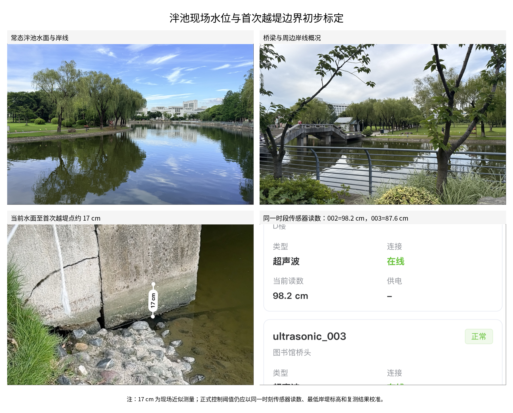
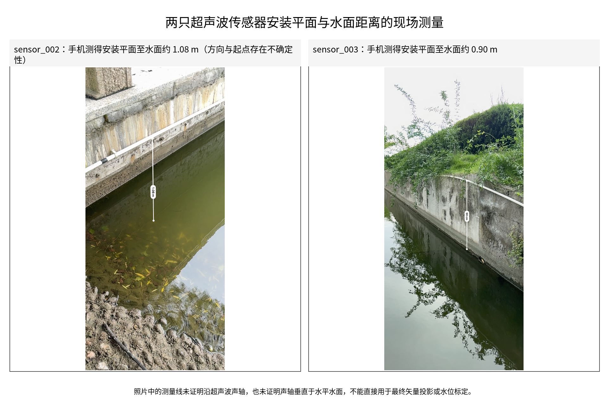
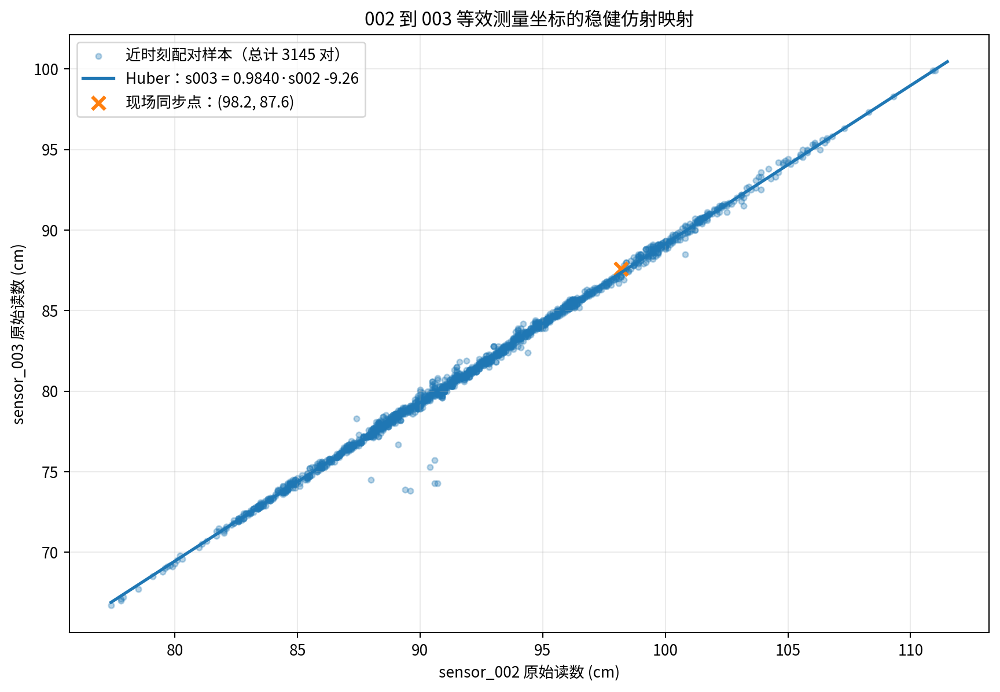
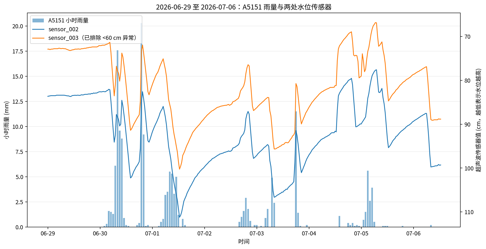
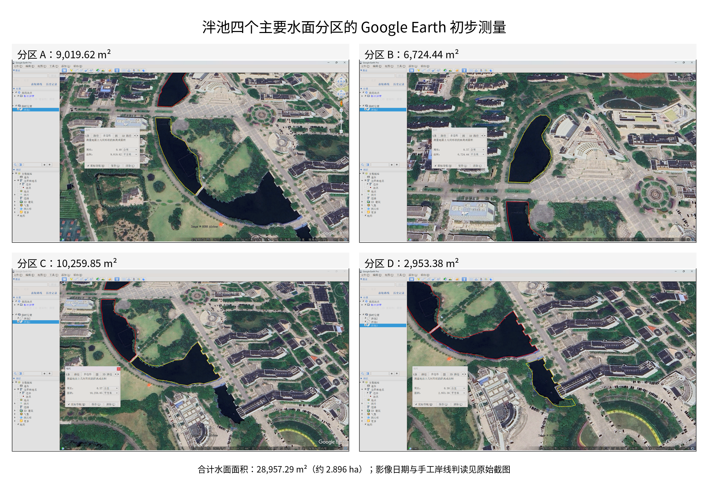
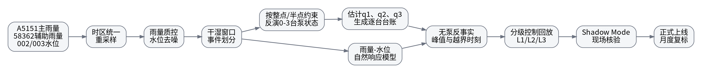
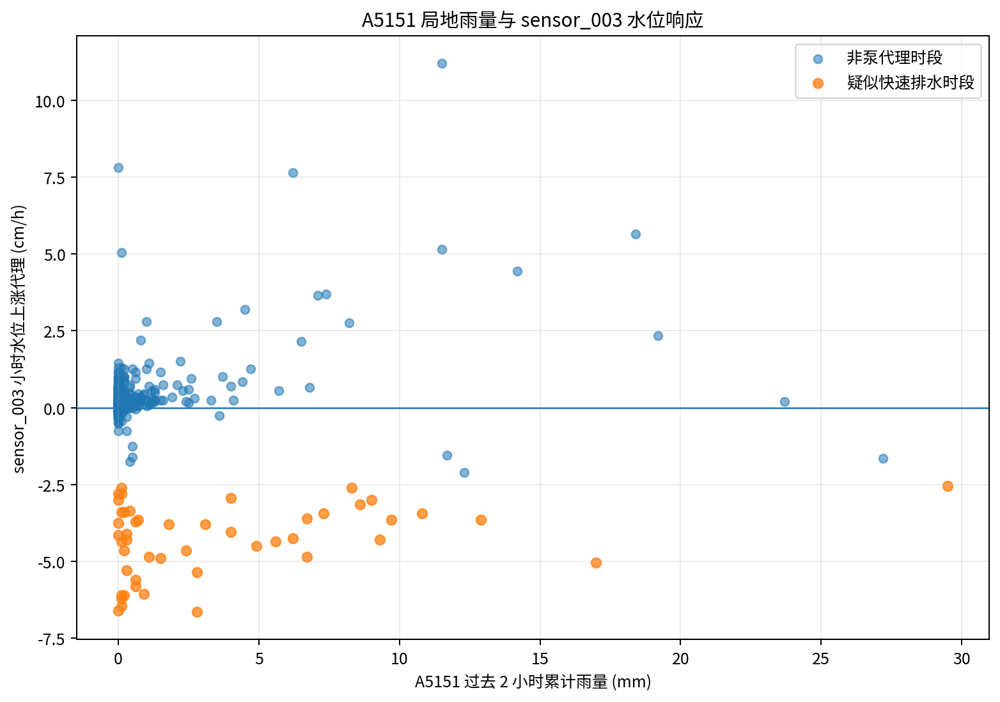

# 雨量—水位—泵站联动分析与自动排水策略研究报告

> **雨量源口径（本版修订）**：校园雨量—水位建模、晴天判定、泵参与识别、无泵反事实计算和自动排水触发，均以 **A5151 宝山大场上大附中站**为主雨量源。**58362 宝山国家站**仅用于区域降雨背景、数据质量交叉核验和 A5151 缺测时的降级参考；两站不得默认求均值、取最大值或等权融合。

> **现场运行、泵组、实测几何与历史边界（本版补充）**：现有排水系统共有 **3 台泵**，日常按“**2 台主用 + 1 台备用**”组织运行，常态通常最多投入两台；极端降雨或越堤风险下允许 **3 台并行排水**。目前仍由人员现场手动开关，未建立精确启停台账，但操作时间通常卡在整点或半点。现场确认泮池在常态下水位基本持平或上涨，排除传感器跳变后，持续水位下降的唯一已知原因是人工启泵。上级部门实地勘测水面面积约 **31,762 m²**，平均水深约 **3.5 m**。最新现场测量表明，测量时水面距最低岸线/首次越堤点约 **17 cm**；同一时段仪表盘读数约为 `sensor_002=98.2 cm`、`sensor_003=87.6 cm`，若暂时假设两只超声波声轴均垂直于水平水面，可得到临时首次越堤读数 `002≈81.2 cm`、`003≈70.6 cm`。由于两只传感器安装平面的法线方向尚未测量，该换算不能作为最终 PLC 定值；正式标定需测量每只声轴相对铅垂方向的姿态，或在多个已知水位下直接拟合水位转换系数。2026 年截至本批数据结束时没有发生越堤；上一年度曾出现水位淹没桥面的极端事件。原报告中的 `002≈70 cm`、`003≈60 cm` 不再定义为首次越堤线，而应视为较首次越堤约再高 **11.2/10.6 cm** 的严重淹没或异常读数区间。

## 执行摘要

## 执行摘要

本报告基于两路小时雨量站数据（A5151、58362）、两路超声波水位传感器数据（ultrasonic_002、ultrasonic_003）以及最新补充的现场运行信息和泮池水面测量结果进行修订。校园雨量—水位建模统一以 **A5151 宝山大场上大附中站**为主雨量源，58362 宝山站只用于区域背景、质量核验和 A5151 缺测时的降级参考。两只水位传感器在重叠时段高度相关，但其安装高程、声轴姿态和零点均可能不同，因此不能用固定读数差直接判断一致性。利用清洗后的 3145 组近时刻配对数据，可建立稳健仿射映射 `s003≈0.9840·s002-9.26`，用于把 002 转换到 003 的等效测量坐标；该映射是统计标定，不是真正的三维矢量投影。

现场补充信息显著提高了泵状态反演的可辨识性：泮池在无泵时水位基本只会持平或上涨，持续水位下降的唯一已知原因是开泵；人工操作通常发生在整点或半点。泵组共有 **3 台**，正常组织方式为 **2 台主用、1 台备用**，常态最多使用两台，但极端情况下可三台全部投入。因此历史泵状态不再建模为简单的“开/关”二状态，而应建模为

\[
n_t\in\{0,1,2,3\}
\]

其中状态切换优先限制在 `xx:00`、`xx:30` 附近，且三泵状态赋予较低先验概率，仅在极端降雨、接近越堤边界或人工应急操作时启用。

当前数据中多个晴天排水时段的主导净降深速率集中在约 **5.9–6.4 cm/h**，中位数约 **6.23 cm/h**。结合“正常最多两台运行”的现场习惯，该主导速率现在更适合解释为**两台泵共同运行时的候选净降深能力**，而不是未知数量泵的泛化泵效。单泵能力和三泵能力目前仍未被独立观测，应分别记为 \(q_1\) 与 \(q_3\)，并满足

\[
0<q_1<q_2<q_3,\qquad q_2\approx 6.2\ \text{cm/h}
\]

但不能未经试验直接设定 \(q_2=2q_1\) 或 \(q_3=1.5q_2\)，因为并联泵会受到共用出水管、扬程、下游水位和泵性能差异影响。

上级部门提供的实地勘测资料显示，泮池水面面积约为

\[
A_0=31,762\ 	ext{m}^2
\]

平均水深约 **3.5 m**。按平面面积乘平均水深进行一阶估算，常态总水体体积约为 **111,167 m³**。这一数值表示近似总水量，不等同于防涝可用调蓄容量；真正可用于承接暴雨的有效余量取决于当前水位至越堤边界之间的高差。

此前 Google Earth 四分区手工测得面积合计 28,957.29 m²，比实地勘测值少 2,804.71 m²，即相对实测值低约 **8.83%**。因此后续体积换算和泵效估算统一采用实测面积 31,762 m²，Google Earth 结果只作为辅助空间核验。卫星影像视角可能是误差来源之一，但 Google Earth 面积工具通常还会受到影像正射校正、岸线判读、树冠遮挡、窄水道遗漏、水位日期差异和勘测边界定义不同等因素影响，不能把约 9% 的差异全部归因于拍摄角度。

在小幅水位变化、各池区水位基本同步的一阶近似下，泮池平均水位变化 1 cm 对应约 **317.62 m³**。若将两泵候选净降深 \(q_2=6.23\ 	ext{cm/h}\) 作用于全部实测水面，则两泵合计净排水量候选值约为 **1,979 m³/h（550 L/s）**；按 5.9–6.4 cm/h 的当前范围，对应约 **1,874–2,033 m³/h（521–565 L/s）**。该结果仍是扣除同期入流后的净排水能力，不是铭牌额定流量，需通过单泵、双泵、三泵受控试验和逐台运行反馈校准。

传感器几何方面，现有照片只给出了安装平面到水面的近似距离，不能证明测量线沿声轴，也不能证明两只声轴平行或垂直于水面。严格物理模型需要分别测量每只声轴与铅垂方向的夹角。当前数据可先提供统计等效转换：

\[
\hat s_{003}
=
0.9840s_{002}
-9.26
\]

现场同步点 `002=98.2` 映射为 `003≈87.36`，与实测 `003=87.6` 相差约 **0.24 cm**。该关系可用于 Shadow Mode 的一致性残差检查，但不能单独恢复真实三维法线方向或绝对水面高程。

最新现场标定显示，当前水面至首次越堤点仅约 **17 cm**，对应剩余平面调蓄体积约：

\[
V_{\mathrm{free}}
\approx
31\,762\times0.17
=
5,399.54\ \text{m}^3
\]

若截图和 17 cm 测量为同一时刻，则首次越堤读数约为 `002=81.2 cm`、`003=70.6 cm`。这意味着旧的 80/70 warning 线已经非常接近甚至可能晚于首次越堤，而 70/60 更属于严重淹没区。两泵在完全无入流时消除 17 cm 水位差约需 **2.73 h**；暴雨中应采用“剩余水位裕度 + 实测上涨速率 + 预计越堤时间”控制，而不能只依赖固定阈值。

自动化控制建议采用分级投入逻辑：第一台泵用于提前控制，第二台泵用于水位继续恶化或预测入流超过单泵能力的情况，第三台泵平时作为备用和故障替补，但在极端事件中允许作为第三级增援泵投入。PLC 改造必须同时记录每台泵的命令、接触器反馈、电流、故障、手动/自动模式和实际运行台账；控制柜与供电系统还必须校核三台电机并行运行及错峰启动时的容量和电压降。

报告中的控制阈值、泵流量和仿真结果仍属于候选工程参数。最终设计应结合 GB 50014-2021 的泵站供电、设计流量、设计扬程、最高/最低水位、检测自动化和故障安全要求，并以“避免再次越堤”为首要验收目标。

## 已有数据初判与关键发现

本次上传数据的基础概况如下。表中数值为本次对 CSV 的直接计算结果。

| 数据流 | 位置/站点 | 起始 | 结束 | 记录数 | 非空率 | 中位数 | 最小值 | 最大值 | 采样中位间隔 | 大于 30 分钟缺口数 |
|---|---|---:|---:|---:|---:|---:|---:|---:|---:|---:|
| rain_A5151 | 宝山大场上大附中 | 2026-05-22 00:00 | 2026-07-06 12:00 | 1093 | 100% | 0.0 mm | 0.0 | 20.3 | 60.0 min | 0 |
| rain_58362 | 宝山 | 2026-05-22 00:00 | 2026-07-06 12:00 | 1093 | 100% | 0.0 mm | 0.0 | 35.8 | 60.0 min | 0 |
| sensor_002 | D楼 | 2026-05-07 00:06 | 2026-07-06 12:32 | 5983 | 100% | 93.2 cm | 77.4 | 111.5 | 14.37 min | 5 |
| sensor_003 | 图书馆桥头 | 2026-06-02 14:09 | 2026-07-06 12:41 | 5983 | 100% | 80.8 cm | 12.3 | 100.5 | 7.57 min | 3 |

### 雨量源优先级与降级规则

| 场景 | 建模与控制口径 |
|---|---|
| A5151 数据正常 | 仅以 A5151 作为雨量—水位响应、晴天判定、泵参与识别和触发逻辑的主雨量输入 |
| A5151 与 58362 差异较大，但 A5151 通过自身时间一致性检查 | 以 A5151 为准；差值仅作为“局地降雨与区域背景不一致”的诊断特征 |
| A5151 短时缺测或明显异常 | 进入 `rain_source_degraded=true` 降级状态；58362 可临时参考，但应使用单独标定的偏差修正，并降低模型置信度 |
| 两站同时异常或缺测 | 禁用纯雨量预触发，只保留经去噪和多点一致性确认后的水位安全阈值控制，并发出数据源异常告警 |

可保留以下辅助变量用于诊断，但不得取代 A5151 主驱动：

\[
R_{\mathrm{local},t}=R_{\mathrm{A5151},t},\qquad
R_{\mathrm{regional},t}=R_{\mathrm{58362},t},\qquad
\Delta R_t=R_{\mathrm{A5151},t}-R_{\mathrm{58362},t}
\]

其中，雨量—水位模型 \(g(\cdot)\) 的主要雨量输入为 \(R_{\mathrm{local}}\) 及其滞后/累计特征；\(R_{\mathrm{regional}}\) 与 \(\Delta R\) 仅作为质量控制、场次分类或可选辅助特征。

从数据质量上看，雨量序列完整度较高，但两站小时雨量的同步相关性仅约 **0.63**，单小时最大差值达到 **24.3 mm**，说明局地对流或站点空间差异已经足以显著影响校园水位建模。由于 A5151 位于宝山大场上大附中，空间上更接近上海大学校园，实际生产中应采用**“局地站主导、区域站校验”**：A5151 的当前雨量及其滞后累计量作为核心产流驱动；58362 不与其求均值、不默认取两站最大值，也不参与等权或距离加权融合，仅用于判断区域降雨背景、发现 A5151 的疑似缺测/异常，以及在 A5151 不可用时进入明确标记的降级模式。两只水位传感器相关性较高，但存在明显零点偏移，因此必须独立校准。与此同时，`sensor_002` 在 15 分钟粒度下出现了 **8 次**大于 3 cm 的单步跳变，`sensor_003` 出现了 **14 次**，最大单步跳变达到 **52.15 cm**，这类时点应在清洗时标记为异常或设备复位。中国自动站小时降水资料的质量控制实践通常会结合**气候学界限、区域界限、时间一致性、空间一致性**等规则；而在时间戳对齐上，pandas 官方也明确 `resample` 需要 datetime-like 索引，并支持 `ffill`、`interpolate` 等重采样补齐方式。citeturn5search1turn4search2turn4search10

### 现场首次越堤边界与传感器标定

现场照片和同步仪表盘记录提供了一次直接的水位标定。测量时：

- `sensor_002` 读数约 **98.2 cm**；
- `sensor_003` 读数约 **87.6 cm**；
- 当前水面至最低岸线/首次越堤点约 **17 cm**。

若暂时假设两只传感器声轴均垂直于水平水面、读数比例为 1，则可得到：

\[
s_{\mathrm{overflow},002}^{(\theta=0)}
\approx
98.2-17
=
81.2\ \text{cm}
\]

\[
s_{\mathrm{overflow},003}^{(\theta=0)}
\approx
87.6-17
=
70.6\ \text{cm}
\]

若第 \(i\) 个传感器声轴与铅垂方向夹角为 \(\theta_i\)，垂直水位上涨 17 cm 对应的声轴读数变化应为：

\[
\Delta s_i
=
\frac{17}{\cos\theta_i}
\]

因此 81.2/70.6 cm 只能作为垂直安装假设下的临时阈值。



该结果应视为**现场初步标定**，而不是最终测绘高程，原因包括：

- 17 cm 是人工近似测量；
- 需要确认照片、仪表盘和两只传感器读数是否严格同一时刻；
- 应沿全池寻找真正的最低岸堤点，而不能只校准一个位置；
- 传感器支架、安装基准或零点可能发生小幅漂移；
- 两只传感器声轴相对铅垂方向的俯仰角、横滚角尚未测量；
- 两只声轴之间的夹角不足以完成校准，必须知道每只声轴分别相对于重力铅垂方向的姿态；
- 风浪、局部回水和桥下水面扰动会造成厘米级变化。

因此，`002≈81.2 cm`、`003≈70.6 cm` 只能用于 Shadow Mode 和人工告警参考，不能直接写入无人值守 PLC 的最终强制阈值。原先使用的 `002≈70 cm`、`003≈60 cm` 比新的首次越堤线分别低约 **11.2 cm** 和 **10.6 cm**，不再代表“刚刚越堤”，而代表已经明显越岸的严重淹没状态，或者传感器发生大幅跳变。

| 风险含义 | sensor_002 参考值 | sensor_003 参考值 | 处理 |
|---|---:|---:|---|
| 当前现场水位 | 98.2 cm | 87.6 cm | 约有 17 cm 首次越堤裕度 |
| 首次越堤参考 | **约 81.2 cm** | **约 70.6 cm** | 最高级水位事件，不能等到该值才启泵 |
| 严重越岸/历史事实异常线 | 约 70 cm | 约 60 cm | 约比首次越堤再高 11 cm；2026 年无此现场事件，孤立读数优先判异常 |
| 极端异常 | 003 的 12.3–47.6 cm 等 | - | 与瞬时跳变相邻，应从连续水位模型中剔除 |

### 传感器测量几何、等效映射与一致性告警

现场对两只传感器安装平面到水面的近似测量如下：



这些照片不能直接给出声轴矢量。手机测距线可能没有从超声波换能器实际发射面起算，也未必沿传感器法线，更未证明测量线垂直于水平水面。因此，在获得姿态测量前，不能把 002 的测量矢量简单做 \(s_{002}\cos\alpha\) 后当作 003 读数；两个传感器的空间原点也不相同。

设第 \(i\) 个传感器原始读数为 \(s_i\)，读数比例和固定偏移为 \(k_i,c_i\)，发射面高程为 \(Z_i\)，声轴与铅垂方向夹角为 \(\theta_i\)。水平水面高程 \(H\) 可写为：

\[
H
=
Z_i
-
(k_i s_i+c_i)\cos\theta_i
\]

消去水面高程后，002 与 003 的读数必然呈仿射关系：

\[
s_{003}
=
a s_{002}+b
\]

其中：

\[
a
=
\frac{k_{002}\cos\theta_{002}}
{k_{003}\cos\theta_{003}}
\]

而截距 \(b\) 同时吸收安装高程差和固定零点偏移。历史水位数据可以估计 \(a,b\)，但不能唯一分解出两只传感器各自的倾角、安装高程和零点。

本报告采用以下临时统计标定流程：

- 使用 002、003 的共同覆盖时段；
- 排除 `002<70 cm`、`003<60 cm` 等严重异常；
- 将每条 002 记录与 5 分钟内最近的 003 记录配对；
- 共获得 **3145** 组有效配对；
- 使用 Huber 稳健回归降低跳变和不同步采样的影响。

得到：

\[
\boxed{
\hat s_{003}
=
0.9840s_{002}
-9.26
}
\]

反向经验关系约为：

\[
\boxed{
\hat s_{002}
=
1.0150s_{003}
+9.52
}
\]

不同时间容差下，002→003 斜率约落在 **0.9840–0.9855**，说明该映射在当前数据范围内较稳定。



现场同步点：

\[
s_{002}=98.2\ \text{cm}
\]

映射结果：

\[
\hat s_{003}
=
0.9840\times98.2
-9.26
=
87.36\ \text{cm}
\]

与实际 `003=87.6 cm` 的残差约为 **+0.24 cm**。垂直安装假设下的 002 首次越堤临时值 81.2 cm，经映射得到 003 等效值约 **70.63 cm**，与临时值 70.6 cm 几乎一致。这说明两个临时阈值在统计坐标关系上互相一致，但仍不能证明它们在物理垂直高程上准确。

定义在线一致性残差：

\[
e_t
=
s_{003,t}
-
\left(
0.9840s_{002,t}
-9.26
\right)
\]

当前配对样本中，绝对残差的中位数约 **0.11 cm**，95% 分位约 **0.42 cm**，99% 分位约 **0.75 cm**。这些数值是在近时刻而非严格同步条件下得到的，快速开泵或暴雨上涨时，采样时间差本身会制造额外残差。因此，正式一致性告警应先把两路数据插值到统一时间轴，并根据当前水位变化速度增加动态容差。

Shadow Mode 可先采用：

```text
expected_003 = 0.9840 * sensor_002 -9.26
residual = sensor_003 - expected_003

|residual| <= 1.0 cm:
    正常

|residual| > 1.5 cm，连续 3 个对齐周期:
    一致性预警，检查遮挡、污损、支架松动和时间同步

|residual| > 3.0 cm 或发生突变:
    强异常候选，进入传感器降级模式
```

上述阈值必须经过实际 Shadow Mode 统计后复标。在任何情况下，传感器不一致都不能直接触发停泵；泵已运行时应保持安全状态，并使用另一传感器、A5151 雨量、泵电流和人工核验决定后续动作。

最终物理标定建议优先采用“多水位直接标定”，而不是只测角度：

1. 测量每只换能器实际发射面的俯仰角和横滚角；
2. 建立统一高程基准，测量传感器发射面、最低岸堤和桥面高程；
3. 在至少 3–5 个不同水位下同步记录人工水准测量和原始读数；
4. 分别拟合：
   \[
   H=\alpha_i+\beta_i s_i
   \]
5. 用姿态计算结果与经验 \(\beta_i\) 交叉核验；
6. PLC 中统一比较换算后的水面高程或物理越堤裕度，而不是比较两个原始距离。

2026 年离线建模仍可将 `002<70 cm`、`003<60 cm` 及其跳变邻域作为严重异常剔除，但不能再用 70/60 作为未来首次越堤触发线。对于介于新首次越堤线和 70/60 之间的历史值，应逐场核验时间连续性、两传感器一致性、现场记录和泵运行形态，不能一律删除或一律当真。

传感器自带状态字段中的 `warning` 区间为 `002=77.4–80.0 cm`、`003=66.2–69.8 cm`。按本次现场初步标定，这些阈值已经落在首次越堤线附近或之后，**明显过晚，不适合作为自动启泵前置阈值**。它们只能作为旧系统状态标签保留，正式 PLC 逻辑应重新定义。

下面这张时序图展示了 2026-06-29 至 2026-07-06 的雨量与两只传感器变化。可以直观看到：降雨后水位（以“传感器值下降”为信号）整体上升，但部分时段会出现快速恢复，符合“泵或快速排水介入”的形态特征。



### 泵状态反演的现场先验

排除异常跳变后，可将现场规律写成以下约束：

\[
n_t=0 \Rightarrow \Delta s_t\lesssim 0
\]

\[
\Delta s_t>0\ \text{且持续、仿射映射残差正常} \Rightarrow n_t\ge 1
\]

其中 \(s_t\) 为超声波传感器值，数值增大表示实际水位下降。考虑人工启停通常卡在整点或半点，历史状态反演应优先在 30 分钟边界寻找变化点，并允许约一个采样周期的时间误差。

在 A5151 过去 6 小时基本无雨、两只传感器同步回升且排除跳变后，当前数据中排水段的主导净降深速率约为：

| 指标 | 当前结果 |
|---|---:|
| 主导候选净降深范围 | 5.9–6.4 cm/h |
| 中位候选值 | **6.23 cm/h** |
| 优先解释 | 两台泵共同运行时的净降深 \(q_2\) |
| 单泵能力 \(q_1\) | 尚未独立标定 |
| 三泵能力 \(q_3\) | 尚未在当前数据中可靠识别 |

这并不排除部分雨天排水段出现单泵运行，也不排除极端情况下三泵并行。后续应使用受约束的隐状态模型或变化点模型同时估计 \(n_t\) 与 \(q_1,q_2,q_3\)，而不是把所有下降段都统一归为同一种泵效。

### 泮池实地勘测面积、水深与体积换算

上级部门提供的实地勘测数据应作为本报告的正式几何基准：

| 参数 | 当前采用值 | 说明 |
|---|---:|---|
| 泮池水面面积 | **31,762 m²** | 实地勘测资料，替代 Google Earth 手工面积作为正式计算值 |
| 平均水深 | **约 3.5 m** | 近似平均值，尚不能替代完整测深地形 |
| 近似常态总水体体积 | **约 111,167 m³** | 由面积 × 平均水深估算 |
| Google Earth 手工面积 | 28,957.29 m² | 辅助核验，不再用于正式流量换算 |
| Google Earth 相对实测偏低 | **8.83%** | 少 2,804.71 m² |

此前 Google Earth 的四分区测量仍可用于说明池体空间构成和连通关系：



面积差异可能来自多种因素叠加：影像并非严格垂直视角、正射校正误差、岸线被树木或阴影遮挡、狭窄连接水域遗漏、影像拍摄时水位不同，以及实地勘测采用的水域边界与人工描边口径不同。后续报告中不应将差异单独归因于卫星倾斜拍摄。

在当前水位附近采用常面积近似：

\[
\Delta V=A_0\Delta h,\qquad A_0=31,762\ \text{m}^2
\]

则：

| 平均水位变化 | 对应体积变化 |
|---:|---:|
| 1 cm | 317.62 m³ |
| 5 cm | 1,588.10 m³ |
| 10 cm | 3,176.20 m³ |
| 20 cm | 6,352.40 m³ |

现场最新测得当前水面至首次越堤点约 **17 cm**，对应当前可用平面调蓄体积约：

\[
V_{\mathrm{free,17cm}}
=
31\,762\times0.17
=
5,399.54\ \text{m}^3
\]

这一约 **5,400 m³** 才是当前条件下与首次越堤直接相关的剩余容量。若预先降低水位 5 cm，可额外增加约 **1,588.10 m³**；降低 10 cm，可增加约 **3,176.20 m³**。是否允许预排到该水位仍需校核景观、生态、泵入口淹没深度和最低安全水位。

平均水深约 3.5 m 可用于估算总水体规模，但自动排水真正关心的是**剩余防涝调蓄空间**：

\[
V_{\mathrm{free}}
\approx
A_0\left(h_{\mathrm{overflow}}-h_{\mathrm{current}}\right)
\]

因此，下一步最重要的几何数据不是继续提高平均水深精度，而是测清：

- 常态水面标高；
- 002、003 对应的实际水面标高；
- 岸堤最低点和历史越堤点标高；
- 泵入口最低安全水位；
- 各池区连接口和出水口标高；
- 水位变化较大时的面积函数 \(A(h)\) 或体积函数 \(V(h)\)。

若两台泵候选净降深取 \(q_2=6.23\ \text{cm/h}\)，则：

\[
Q_{2,\mathrm{net}}
=
A_0q_2
\approx
1,979\ \text{m}^3/\text{h}
\approx
550\ \text{L/s}
\]

按当前 5.9–6.4 cm/h 范围，约为 1,874–2,033 m³/h（521–565 L/s）。由于无泵时水位通常持平或上涨，真实泵组流量应满足：

\[
Q_{2,\mathrm{pump}}
=
Q_{2,\mathrm{net}}+Q_{\mathrm{inflow}}
\]

所以该范围仍是两泵合计能力的净值候选，而不是额定流量。单泵和三泵能力必须分别标定。

## 所需输入字段与默认假设

如果目标是把“估算—反推—自动控制”真正做成可运行系统，建议把输入字段分为**必需字段**与**增强字段**两层。

| 字段 | 是否必需 | 推荐格式 | 当前是否具备 | 说明 |
|---|---|---|---|---|
| 时间戳 | 必需 | `YYYY-MM-DD HH:MM:SS`，含时区 | 已具备 | 所有数据统一到同一时区，建议保留秒级 |
| A5151 小时雨量 | **主输入，必需** | mm / hour-end timestamp | 已具备 | 校园模型、晴天识别、反事实计算与泵控触发的主雨量源 |
| A5151/校园本地短时雨强 | 强烈建议 | 5/10/15 min mm | 未具备 | 应优先获取局地短时雨强，用于泵提前触发；58362 不替代本地短时输入 |
| 58362 宝山站小时雨量 | 辅助 | mm / hour-end timestamp | 已具备 | 仅用于区域背景、质控和 A5151 缺测时的降级参考，不与 A5151 默认融合 |
| 水位传感器原始值 | 必需 | cm | 已具备 | 当前“数值越低表示水位越高” |
| 声轴姿态 | **必需** | 每只传感器相对铅垂方向的俯仰/横滚角 | 未具备 | 仅知道两法线夹角不够；需分别测量 002、003 相对重力方向的姿态 |
| 统一高程标定 | **必需** | `H=α+βs` | 未具备 | 至少 3–5 个已知水位点，吸收倾角、零点和比例误差 |
| 双传感器仿射映射 | 建议 | `s003=a·s002+b` | **初步具备** | 当前稳健估计 `a=0.9840, b=-9.26`，仅用于一致性诊断 |
| 水位状态标签 | 建议 | `normal/warning/danger` | 已具备 | 可用于回推经验阈值 |
| 各泵运行状态 | **必需** | 每台泵启停命令 + 实际反馈 | **未具备** | 共 3 台；需分别记录 P1/P2/P3，支持 0–3 台状态识别，不能只记录“泵站开/关” |
| 泵组角色与可用性 | **必需** | `duty/standby/available/fault` | 已知配置，未数字化 | 正常为 2 主 + 1 备；极端工况允许三台并行，角色应可轮换 |
| 手动/自动模式 | **必需** | `manual/auto/off` | 未具备 | 用于区分人工干预、自动控制和检修停机 |
| 接触器辅助触点反馈 | **必需** | 0/1 | 未具备 | 验证接触器是否实际吸合，避免“发出命令但泵未运行” |
| 过载/故障状态 | **必需** | 0/1 + 故障码 | 未具备 | 用于启泵失败、热继电器/保护动作告警 |
| 泵电流/功率/频率 | 强烈建议 | A / kW / Hz | 未具备 | 识别实际运行、空转、堵转和效率下降 |
| 泵流量 | 强烈建议 | m³/h 或 L/s | 未具备 | 有则可直接做体积平衡 |
| 泮池水面面积/蓄水曲线 | 强烈建议 | m²；进一步形成 \(A(h)\) 或 \(V(h)\) | **初步具备** | 实地勘测面积 31,762 m²、平均水深约 3.5 m；尚缺岸堤/泵口标高、测深地形和水位—面积曲线 |
| 首次越堤标定 | **必需** | 水位裕度 cm + 统一高程 | **初步具备** | 当前约有 17 cm 裕度，对应 002≈81.2、003≈70.6 cm；需复测最低岸堤和统一高程 |
| 关键标高 | 建议 | m，相对统一基准 | 未具备 | 岸堤最低点、桥面、传感器、泵入口、出水口和下游水位 |
| 排水下游边界条件 | 建议 | 水位或通畅状态 | 未具备 | 回水顶托会改变泵效 |
| 校园局地天气预报雨量 | 建议 | 1h/3h/6h 预测 | 未具备 | 支持预触发逻辑；应优先采用覆盖上大校园的网格/临近预报，不以宝山站实况直接代替 |

在缺少若干关键字段的情况下，建议当前版本使用以下默认假设，并同步做敏感性分析：

| 未指定项 | 当前默认值 | 推荐敏感性范围 | 说明 |
|---|---:|---:|---|
| 统一建模时间步长 | 15 min | 5–15 min | 兼顾当前传感器与小时雨量 |
| A5151 雨量分配到 15 分钟 | A5151 小时值在该小时内均匀分配 | 均匀 / 后置 / 前置 三方案 | 用于敏感性分析；58362 不参与该分配的主驱动计算 |
| 干天判定 | A5151 过去 6 h 累计雨量 = 0 | 4–12 h | 用于识别泵基线事件；58362 仅用于提示区域降雨背景，不直接否决局地干天样本 |
| 雨量源降级 | A5151 正常时禁止自动切换到融合值 | A5151 缺测 1–2 个采样周期后进入降级 | 降级期间需设置质量标记、降低模型置信度并优先依赖水位阈值 |
| 排水状态识别 | 两只传感器连续同向增大、排除跳变，且变化点靠近整点/半点 | 允许 ±1 个采样周期 | 用于区分 0/1/2/3 台运行；单个采样点不直接判泵态 |
| 泵态切换先验 | 优先仅在 `xx:00` / `xx:30` 变化 | 可容忍人工延迟和采样偏差 | 三泵状态允许但施加低频先验，不得硬性禁止 |
| 两泵候选净降深 \(q_2\) | 6.23 cm/h | 5.9–6.4 cm/h | 结合现场“常态最多两台”先验；单泵和三泵仍待标定 |
| 当前水位附近水面面积 \(A_0\) | 31,762 m² | 小幅变化采用实测面积；大幅变化用 \(A(h)\) | 上级部门实地勘测值；平均水深约 3.5 m |
| 参考安装高度 \(H_{\mathrm{ref}}\) | 先不参与变化率建模 | 若需绝对水深，可设 100 cm ± 5 cm | 变化建模不依赖该绝对值 |
| 训练历史长度 | 至少 8–12 场降雨 | 6–30 场 | 少于此值不宜上复杂模型 |

就数据处理原则而言，推荐流程是：先做时区统一与重采样，再做雨量质量控制与水位异常识别，最后才进入模型拟合。中国气象资料质量控制实践和 pandas 官方文档都支持这一先清洗、后对齐、再建模的顺序。citeturn5search1turn4search2turn4search10

## 数据处理、特征工程与建模框架

建议采用下面这条主流程，把“清洗—泵态反演—反事实—分级控制回放”做成一个可以每周自动重跑、每月复标的流水线。



### 数据清洗与对齐

水位序列建议先重采样到统一粒度，再执行四类清洗：第一类是物理界限检查；第二类是单步跳变检查；第三类是短缺口插值；第四类是长缺口保留为空值。雨量序列则至少做气候学界限、时间一致性和空间一致性检查，但空间一致性检查只用于判别数据质量，**不能把 A5151 与 58362 自动融合为一个雨量值**。A5151 先独立完成自身连续性、突变和异常零值检查，58362 仅提供区域背景交叉核验；若二者冲突而 A5151 自身质控通过，校园模型仍以 A5151 为准。该规则体系与国内自动站小时降水资料质控实践一致。时间对齐方面，pandas 官方 `resample`、`ffill` 与 `interpolate` 足以支撑这一部分的生产实现。citeturn5search1turn4search2turn4search10

对水位而言，由于“传感器数值越低表示水位越高”，建模时不建议直接用原始值 \(s_t\) 做全部推导，而应定义一个“正向上涨变量”：

\[
h_t = H_{\mathrm{ref}} - s_t
\]

其中 \(h_t\) 越大表示水位越高；若不掌握 \(H_{\mathrm{ref}}\)，也可以只建模差分：

\[
\Delta h_t = -(s_t-s_{t-1})
\]

由于两只传感器的声轴倾角和比例系数尚未物理标定，不能预先假设差分尺度完全一致。当前应先通过稳健仿射映射转换到同一等效测量坐标；完成多水位物理标定后，再转换到统一水面高程。

对水位异常建议采用“**年度事实边界 + 瞬时跳变 + 在线连续确认**”三层规则：

```text
离线训练（针对确认未出现严重淹没的 2026 年样本）：
  002 < 70 cm 或 003 < 60 cm  → 严重异常候选，结合连续性和双点一致性剔除
  |单步变化| > 3 cm           → 标记跳变候选
  极端值前后 1–2 个正常采样周期 → 一并屏蔽，避免插值污染

在线控制：
  接近 002≈81.2 cm / 003≈70.6 cm → 首次越堤级紧急事件，不得等待 70/60
  单个传感器孤立越线且另一点、斜率和雨量不支持 → 保持安全泵态，立即故障告警并核验
  连续 2–3 次越线或多源确认 → 全能力排水 + 人员应急处置
```

这里“保持既有安全状态”意味着：若泵已运行，不因异常读数停泵；若泵未运行，则依据另一只传感器和 A5151 雨量决定是否预防性启泵，而不是由单个明显跳变值直接反复启停。

### 特征工程

建议至少构造以下特征：

| 特征类别 | 推荐特征 |
|---|---|
| 主雨量特征（A5151） | A5151 当前雨量、前 1/2/3 小时雨量、2h/3h/6h 累计雨量、过去 1h 最大强度；这些特征构成模型的核心产流输入 |
| 辅助雨量诊断（58362） | 58362 当前/累计雨量、A5151−58362 差值、两站是否同场降雨；仅用于质控、区域背景和降级识别，不与 A5151 默认平均 |
| 水位特征 | 各自原始读数、002→003 等效映射值、仿射残差、统一高程（完成标定后）、1/2/3 阶差分、近 1h 斜率、近 3h 峰谷差 |
| 状态特征 | 干天/雨天标记、日夜时段、工作日/周末 |
| 泵状态特征 | 0/1/2/3 台运行、整点/半点变化点、每台接触器反馈、电流/功率、主备角色与故障状态 |
| 环境特征 | 下游回水、潮位、路面积水面积分段、地面高程差 |

在当前上传数据上，用 `sensor_003` 做一个简化 benchmark：后续复跑时，所有“当前雨量”“滞后雨量”和“累计雨量”均应明确取自 **A5151**。首轮分析得到的参考结果为：若只使用 A5151 的“2 小时累计雨量”预测“小时水位上涨代理”，在非泵代理时段用时间留后验证，线性回归约可达到 **R² ≈ 0.49、MAE ≈ 0.63 cm/h**；若加入 A5151 当前雨量、1–3 小时滞后雨量与滞后水位，时间留后验证约可达到 **R² ≈ 0.56、MAE ≈ 0.60 cm/h**。这些指标用于说明初版模型的量级；正式固化前应在代码中检查并锁定 `rain_source=A5151` 后完整复跑，避免首轮流程中可能存在的雨量源混用。当前数据能够支撑一个可解释的初版模型，但还不足以支撑高置信度的泵控闭环。

下面这张散点图展示了 `sensor_003` 在小时尺度上的“**A5151 两小时累计雨量**—水位上涨代理”关系，并将“疑似泵代理时段”单独着色。可以看到，非泵代理时段总体呈正相关，而泵代理时段在相同局地雨量下会明显向下偏移。若现有图片由旧流程生成，重新发布报告时应按 A5151 锁定口径重绘。



如果把这些时段做一个粗粒度“差分/匹配”比较，在 `sensor_003` 上可得到如下代理效应：

| A5151 2h 累计雨量区间 | 非泵代理平均上涨 | 泵代理平均上涨 | 代理效应差 |
|---|---:|---:|---:|
| 0–0.5 mm | +0.16 cm/h | -4.36 cm/h | -4.52 cm/h |
| 0.5–2 mm | +0.48 cm/h | -3.96 cm/h | -4.44 cm/h |
| 2–5 mm | +0.93 cm/h | -4.63 cm/h | -5.56 cm/h |
| 5–10 mm | +3.19 cm/h | -3.68 cm/h | -6.87 cm/h |
| 10+ mm | +6.95 cm/h | -2.71 cm/h | -9.66 cm/h |

这里仍不能宣称已经获得严格因果效应，因为缺少逐台启停台账；但现场确认“排除跳变后，持续水位下降只由开泵造成”，使泵状态代理的可信度明显提高。当前主要不确定性已从“是否开泵”转变为“开了几台、具体何时切换、雨天同期入流多大”。因此后续应重点解决 1/2/3 台状态区分，而不是继续把所有下降段视为同一种模糊排水事件。

### 候选模型比较

下表给出生产可选模型的优缺点、所需数据与适用场景。模型能力说明依据 scikit-learn、statsmodels、DoWhy/CausalML、EPA SWMM 与 USGS 的官方或原始资料整理。citeturn2search2turn2search0turn2search5turn4search1turn4search8turn3search1turn3search2turn4search19

| 模型 | 优点 | 缺点 | 所需数据 | 输出类型 | 适用场景 |
|---|---|---|---|---|---|
| 线性回归 / 分布滞后回归 | 可解释、上线快、适合先做基线 | 非线性与阈值效应表达有限 | 雨量、水位、基本时间特征 | \(\Delta h_t\) 或 \(h_t\) 预测 | 数据刚起步、先做工程版 |
| ARIMA / ARIMAX | 适合单序列自相关与短期预测 | 多传感器联动弱、解释性一般 | 单点长序列 + 外生雨量 | 单点未来若干步预测 | 单站点短期预报 |
| VAR | 联合建模多序列，适合雨量—多水位协同 | 数据量要求更高，对缺失敏感 | 多点同步序列 | 联合预测、脉冲响应 | 多传感器联动分析 |
| 因果推断 / 差分匹配 | 可估泵的净处理效应 | 依赖泵状态或较强代理变量 | 泵状态、雨量、水位、协变量 | ATE/CATE、反事实效应 | 评估泵策略是否真的有效 |
| 物理水量平衡模型 | 最接近工程机制，可解释性强 | 需要面积、排水能力、边界条件 | 雨量、泵流量、面积、标高、下游边界 | 水位过程、体积收支 | 设计与控制一体化 |
| SWMM 或简化储槽模型 | 可仿真事件与连续期，能表达泵、蓄水、管网 | 参数多、标定成本高 | 子汇水区、管网、泵、降雨 | 系统级水位/流量仿真 | 工程上线前的方案验证 |

### 模型验证与不确定性评估

模型验证必须采用**时间序列友好**的方法，而不是随机打散。建议同时采用三种验证：

第一，**滚动起点验证**。即按时间从前到后滚动训练窗与测试窗，检验在真实部署环境下模型是否稳定。  
第二，**按降雨事件留一验证**。把整场雨作为一个整体留出，更能检验模型跨事件泛化。  
第三，**极端事件专项检验**。对峰前 1–3 小时、峰值时刻、峰后回落分别考核。citeturn2search0turn2search5turn3search1

指标上建议分成四组：  
一组看整体误差，用 MAE、RMSE、\(R^2\)；  
一组看峰值风险，用峰值误差、峰值时刻误差、超过警戒线时长误差；  
一组看残差结构，用残差图、ACF/PACF、Ljung-Box；  
一组看工程可用性，用“触发是否过早/过晚”“启停次数”“总运行时间”“危险阈值以下暴露时长”。ARIMA/VAR 是否合格，不只看 \(R^2\)，更看残差是否还存在结构性自相关。citeturn2search0turn2search5

不确定性评估至少要覆盖六个来源：A5151 对校园局地降雨的代表性及其缺测降级修正、异常点处理方式、0/1/2/3 台泵状态误判、实地面积精度、平均水深近似及水位—面积关系、传感器声轴姿态与仿射标定误差、雨天同期入流、以及模型形式不确定性。建议采用 bootstrap、事件级重采样和参数敏感性扫描三种办法同步报告置信区间。由于水位—流量关系的站点唯一性和时间漂移，USGS 也强调 rating curve 的不确定性需要持续表征，这一点与本项目完全一致。citeturn4search15turn4search19

## 泵状态反演、无泵反事实与分级自动控制

### 四状态水量平衡模型

定义：

- \(s_t\)：传感器原始值，越低表示实际水位越高；
- \(h_t=H_{\mathrm{ref}}-s_t\)：正向水位；
- \(n_t\in\{0,1,2,3\}\)：运行泵数；
- \(q_{n_t}\)：对应泵数下的净降深能力；
- \(g(r_t,h_t,X_t)\)：无泵时由雨量、汇流和其他入流造成的自然上涨；
- \(\Delta t\)：时间步长。

状态方程可写为：

\[
h_t=h_{t-1}+g(r_t,h_{t-1},X_t)-q_{n_t}\Delta t+\varepsilon_t
\]

并满足：

\[
q_0=0,\qquad 0<q_1<q_2<q_3
\]

现场先验还包括：

1. 排除异常后，无泵时传感器值不会持续上升；
2. 状态变化优先发生在 `xx:00` 或 `xx:30`；
3. 常态运行状态以 0、1、2 台为主；
4. 三台并行允许发生，但先验概率较低，主要对应极端降雨、接近越堤边界或人工应急；
5. 两只传感器转换到同一等效坐标后，应对真实排水呈一致方向变化，且仿射残差不应持续超限。

### 历史泵状态反演

建议采用受约束隐马尔可夫模型、动态规划或变化点检测。对每个 30 分钟时间步，求解：

\[
\hat n_t
=
\arg\min_{n_t\in\{0,1,2,3\}}
\left[
\sum_i w_i\bigl(\Delta s_{i,t}-q_{n_t}\Delta t+\hat g_t\bigr)^2
+\lambda_{\mathrm{switch}}\mathbf 1(n_t\ne n_{t-1})
+\lambda_3\mathbf 1(n_t=3)
\right]
\]

其中：

- \(\lambda_{\mathrm{switch}}\) 抑制不合理的频繁启停；
- \(\lambda_3\) 表示三泵状态的低频先验，而不是禁止三泵；
- 变化点不在整点/半点附近时增加额外惩罚；
- 传感器异常或两点冲突时降低相应权重 \(w_i\)。

当前可将 \(q_2\) 的初始先验设在 5.9–6.4 cm/h；\(q_1\) 和 \(q_3\) 使用宽松先验并由数据学习。不能直接固定：

\[
q_1=\frac{q_2}{2},\qquad q_3=\frac{3q_2}{2}
\]

因为多泵并联后的总流量通常不严格与泵数成正比。

### 无泵反事实

完成泵状态反演后，无泵水位过程按以下方式递推：

\[
h_t^{(0)}
=
h_{t-1}^{(0)}
+
g(r_t,h_{t-1}^{(0)},X_t)
\]

在短时近似下，也可从观测传感器值恢复：

\[
s_t^{(0)}
\approx
s_t
-
\sum_{\tau\le t}q_{n_\tau}\Delta t
\]

雨天必须同时估计同期入流；否则仅把 \(q_2\) 加回会低估无泵水位上涨。最终输出应至少包括：

- 最可能泵数状态 \(\hat n_t\)；
- 状态置信度；
- 有泵实测曲线；
- 无泵反事实曲线；
- 无泵峰值、越过预警线时刻及越堤边界暴露时间；
- 面积换算后的泵出水体积和不确定区间。

### 统一水位裕度与预计越堤时间

当前的 `81.2/70.6 cm` 来自声轴垂直假设。在姿态和多水位标定完成前，不能把以下原始差值直接称为真实垂直厘米：

\[
m_{002,t}
=
s_{002,t}-81.2
\]

\[
m_{003,t}
=
s_{003,t}-70.6
\]

它们只能称为“传感器坐标中的临时越堤余量”。如果声轴与铅垂方向夹角为 \(\theta_i\)，且读数比例已校准为 \(k_i\)，物理垂直裕度应为：

\[
H_{i,t}
=
k_i
\left(
s_{i,t}-s_{\mathrm{overflow},i}
\right)
\cos\theta_i
\]

正式系统应先将 002 映射到 003 等效坐标，利用残差判断传感器健康；随后分别通过各自的 \(\alpha_i,\beta_i\) 转换到统一水面高程，才能取保守的有效裕度。

在 Shadow Mode 中，可以暂时保留垂直安装假设用于相对风险排序，但界面必须明确标注“未完成声轴姿态校准”。当水位正在上涨时，同一传感器坐标内的预计越堤时间可写为：

\[
T_{\mathrm{overflow},i}
=
\frac{m_{i,t}}
{-\mathrm d s_i/\mathrm d t}
\]

只要临时越堤阈值本身正确，该时间比值中的角度比例会相互抵消；但目前阈值仍来源于垂直假设，所以不能作为最终无人值守控制依据。

完成物理标定后，统一使用：

\[
T_{\mathrm{overflow}}
=
\frac{H_t}{v_{\mathrm{rise}}}
\]

其中 \(H_t\) 是统一高程下的剩余垂直裕度，\(v_{\mathrm{rise}}\) 是实际垂直上涨速度。

### 分级泵组控制逻辑### 分级泵组控制逻辑

三台泵应采用“**正常两台分级投入，第三台兼具备用与极端增援功能**”的控制架构，而不是永久锁定为不可参与的备用泵。

| 控制级别 | 典型条件 | 泵组动作 |
|---|---|---|
| L0 正常 | 水位安全、无显著上涨趋势 | 全停；轮换确定下一台首启泵 |
| L1 提前控制 | 任一有效传感器进入启动线，或局地雨强与上涨斜率表明即将进入启动线 | 启动 1 台主泵 |
| L2 加强排水 | 单泵运行后水位仍上涨、预测入流超过单泵能力、或进入强制启动区 | 投入第 2 台泵 |
| L3 极端/应急 | 两泵运行仍无法控制水位、接近越堤级边界、极端短时雨强，或人工确认需要全能力 | 投入第 3 台泵，三泵并行 |
| 故障替补 | 任一运行泵拒动、过载或无有效电流/流量反馈 | 备用泵立即替补；若风险已达 L3，可保持其余可用泵全开 |

“2 主 + 1 备”应作为日常调度角色，而不是固定设备身份。建议根据累计运行时间轮换首启泵和备用泵，使三台设备老化相对均衡。

### 启停与滞回建议

现阶段应从“固定原始读数阈值”改为“经几何标定的剩余越堤裕度 + 趋势”。下表仍按声轴垂直假设列出，仅用于 Shadow Mode 和人工回放，不得直接作为最终 PLC 定值：

| 级别 | 剩余裕度 \(H\) | sensor_002 约值 | sensor_003 约值 | 候选动作 |
|---|---:|---:|---:|---|
| 预警 | ≤12 cm | ≤93.2 cm | ≤82.6 cm | 提醒值守，检查雨量、泵可用性和下游状态 |
| L1 | ≤10 cm 或预计 2 h 内越堤 | ≤91.2 cm | ≤80.6 cm | 启动第 1 台泵 |
| L2 | ≤7 cm、单泵无法扭转上涨，或预计 1 h 内越堤 | ≤88.2 cm | ≤77.6 cm | 投入第 2 台泵 |
| L3 | ≤5 cm、两泵仍上涨，或预计 30 min 内越堤 | ≤86.2 cm | ≤75.6 cm | 投入第 3 台泵并进入极端事件模式 |
| E0 | ≤0 cm | ≤81.2 cm | ≤70.6 cm | 首次越堤；全泵保持、最高级告警和现场封控 |

停泵线不能再沿用旧表固定值，应以“水位裕度恢复到 12–15 cm、A5151 雨量明显衰减、上涨趋势消失、无未解除告警”为基础逐级退出，并通过 Shadow Mode 回放确定。

第三台泵不宜只绑定一个固定水位点，应采用组合条件，例如：

```text
两泵已确认运行
AND 持续 10–15 min 后水位仍上涨或下降不足
AND (
    剩余越堤裕度 H ≤ 5 cm
    OR 预计 30 min 内首次越堤
    OR A5151/校园短时雨强达到极端阈值
)
→ 投入第三台泵并进入 L3

三泵均已确认运行
AND 水位连续 10–15 min 仍上涨
→ 标记 CAPACITY_EXCEEDED
→ 禁止自动退泵，保持全部可用泵
→ 最高级通知、桥面/岸边封控、现场值守和下游排水检查
```

停泵建议逐级退出，而不是三台同时停机：

1. 三泵状态下先退出第三台；
2. 观察至少一个稳定窗口；
3. 水位和雨量继续满足退出条件后再退出第二台；
4. 最后一台泵达到停泵线、雨量衰减且无未解除告警后停机。

### 超能力事件与去年的桥面淹没

上一年度水位曾淹没桥面，说明该事件显著超过“首次越堤”阶段，也可能超过三泵合计能力。自动化系统不能把目标写成“任何暴雨下绝不淹水”，而应分层定义：

1. **常见和设计工况**：通过提前启泵、分级投入和预排水避免首次越堤；
2. **超标准工况**：尽量削减峰值、延迟越堤时间并维持全部可用排水能力；
3. **能力已超过工况**：明确报告 `CAPACITY_EXCEEDED`，为人员封控、桥面关闭、电气设备保护和现场抢险争取时间。

桥面淹没标高不能从照片透视关系可靠推算。后续应直接测量：

- 最低岸堤标高；
- 桥面最低点标高；
- 传感器安装基准标高；
- 去年可能遗留的高水痕迹；
- 水泵入口、出水口及下游受纳水体标高。

### 电气和机械联锁

由于极端情况下允许三泵并行，暑期改造必须按三台同时运行的最不利工况校核：

- 变压器、馈线、断路器、母排、接触器和电缆的持续载流能力；
- 电机启动电流和三台错峰启动造成的电压降；
- 共用出水管、止回阀、阀门和下游排水能力；
- 三泵并行时是否导致扬程上升、效率下降或下游顶托；
- 每台泵独立的短路、过载、缺相和故障反馈。

PLC 应采用顺序启动，不允许三台在同一时刻同时合闸。具体启动间隔应根据电机功率、启动方式和供电容量计算后确定。

### 雨量输入的生产约束

```yaml
rainfall:
  primary_station: A5151
  auxiliary_station: "58362"
  fusion_mode: none
  allow_auxiliary_trigger: false
  degraded_mode:
    enabled: true
    require_quality_flag: true
    lower_model_confidence: true
```

58362 单站降雨不得直接触发泵组升级；A5151 不可用时，应显式进入降级模式，并以有效水位、上涨斜率和人工确认作为主要安全依据。

### 自动化事件台账

每次状态变化应按泵分别记录：

```yaml
pump_event:
  timestamp: "ISO-8601"
  control_mode: manual | auto | off
  requested_running_count: 0 | 1 | 2 | 3
  reason_code: level_stage_1 | level_stage_2 | extreme_stage_3 | rainfall_pretrigger | fault_substitution | manual_operator | test
  pumps:
    P1: {command: start, contactor: on, current_a: null, fault: false, role: duty}
    P2: {command: start, contactor: on, current_a: null, fault: false, role: duty}
    P3: {command: stop,  contactor: off, current_a: null, fault: false, role: standby}
  source:
    water_level_002_cm: null
    water_level_003_cm: null
    rainfall_station: A5151
    rainfall_1h_mm: null
```

只有建立逐台台账后，才能可靠区分 \(q_1,q_2,q_3\)，并验证备用泵替补和三泵应急逻辑。


## GB 50014-2021 对本项目的适用性与设计约束

### 规范适用边界

《室外排水设计标准》GB 50014-2021 第 1.0.2 条适用于城镇、工业区和居住区新建、扩建和改建的**永久性室外排水工程设计**。因此，如果本项目暑期实施的是固定水泵、控制柜、PLC、接触器、液位检测和永久管路的工程化改造，应将该标准作为主要设计依据之一；如果当前阶段仍只是监测研究或临时试验装置，则可作为工程化目标和验收前置依据，但不能据此宣称试验系统已经满足正式泵站设计要求。

第 1.0.7 条提出排水工程设备应实现机械化、自动化并逐步实现智能化。这为本项目从人工启停升级到 PLC 自动控制提供了总体方向，但具体电气保护、低压配电、接地、防雷、电动机控制和施工验收还需要同时执行相应的电气类国家标准，不能仅依靠 GB 50014-2021 完成设计。

### 与本项目直接相关的强制性条文

住房和城乡建设部发布公告明确列出了 GB 50014-2021 的强制性条文。就本项目目前的范围而言，直接或可能相关的主要有以下三项：

| 条文 | 强制性内容 | 与本项目的关系 | 应落实的事项 |
|---|---|---|---|
| **6.1.12** | 排水泵站供电应按二级负荷设计；特别重要地区的泵站应按一级负荷设计 | **直接相关，是当前最重要的强制性条文** | 在正式改造前确定设施重要性和供电负荷等级；不能把一条普通单路电源作为唯一可靠性设计。备用电源、双路电源或其他实现方式应由电气专业按适用标准确定 |
| **4.1.6** | 地区改建后，在相同设计重现期下的径流量不得超过改建前 | **条件相关** | 若项目同时改变道路、硬化面、绿地、汇水范围、排水沟或管路布置，应校核改建前后径流量；若仅增加 PLC 和接触器而不改变汇水条件，则不是当前控制系统的核心约束 |
| **5.15.3** | 污水管道、合流管道与生活给水管道相交时，应位于给水管下方或采取防护措施 | **仅在新增管路交叉时相关** | 若暑期工程新增埋地排水管，并与生活给水管相交，需要纳入管线综合设计；单纯控制柜改造通常不涉及 |

标准公告列出的其余强制性条文主要涉及污水水质、处理设施、污泥消化和自然处理等，与本校园雨水监测及排水泵自动化改造没有直接关系。报告中不应笼统写成“第 6 章和第 9 章均属于强制性条文”。

### 雨水系统层面的指导要求

GB 50014-2021 第 3.2.1、3.2.4 和 3.2.5 条要求雨水系统同时考虑源头减排、排水管渠、排涝除险和应急管理，并将这些措施作为整体校核；对超过设计重现期的降雨，还应通过工程性与非工程性措施提高韧性。

这意味着本项目不能只把“自动开泵”作为唯一解决方案，完整方案至少应覆盖：

1. **监测预警**：本地水位、A5151 局地雨量、传感器健康、泵运行反馈和故障状态；
2. **排水能力**：水泵、进出水管路、受纳水体或下游管网的实际能力；
3. **源头和路径治理**：雨水口、排水沟、格栅、管路堵塞、局部调蓄和汇水路径；
4. **超标准应急**：去年越堤事件对应的人员通知、现场处置、手动强制控制和设备故障预案。

第 4.1.3～4.1.5 条以设计重现期、地面积水深度和雨停后的最大允许退水时间作为雨水系统设计与评价依据。本报告目前使用的“最低传感器值、越堤边界、危险暴露时长和退水时间”与该评价思路一致，但正式设计时仍应由具备资质的设计人员结合校园所在区域性质、重要程度和当地规划，确定适用的设计重现期，不能仅根据现有两个月数据自行认定。

### 水泵能力与启停水位不能只靠历史回归确定

当前主导排水段约 **5.9–6.4 cm/h**，结合现场运行习惯，优先作为两台泵共同运行时的候选净降深能力 \(q_2\)。单泵 \(q_1\) 与三泵 \(q_3\) 仍未独立标定，且 实地勘测水面面积 31,762 m² 和平均水深约 3.5 m 已作为新的几何基准。GB 50014-2021 对正式泵站设计提出了更完整的水力要求：

| 条文 | 规范要求 | 对当前报告的修正意义 |
|---|---|---|
| **6.2.2** | 雨水泵站设计流量应按进水总管的设计流量确定 | 最终泵容量必须基于汇水面积、暴雨强度、径流系数、汇流时间及管网条件核算，不能把历史水位下降速率直接当作额定流量 |
| **6.2.5** | 雨水泵设计扬程应根据集水池水位、受纳水体平均水位差和管路水头损失确定 | 必须补测出水去向水位、管径、长度、弯头阀门和高程；只知道电机功率或水位下降速度不足以选泵 |
| **6.3.4** | 集水池最高设计水位不得导致上游地面冒水 | 自动控制的正常启动线和强制启动线必须早于岸堤/冒水边界，不能等到首次越堤参考值 `002≈81.2 cm` 或 `003≈70.6 cm` 才开始排水 |
| **6.3.6** | 最低设计水位应满足水泵吸水水头和叶轮浸没要求 | 停泵线不能只追求“水位越低越好”；需防止水泵缺水、吸气、涡流、空转或失去有效冷却 |
| **6.4.2** | 水泵应在设计扬程附近的高效区运行，并在最高、最低工作扬程范围内安全稳定 | 自动化后应采集电流/功率，条件允许时增加流量或出口压力，以识别堵塞、空转、回流和偏离高效区 |
| **6.5.1** | 多泵共管时应设置相应阀门和止回设施；雨水泵出水端宜防倒流 | 若下游水位、河道水位或管网回水可能升高，应把倒流和顶托作为泵效下降及越堤风险的一部分 |

实地勘测面积 31,762 m²、平均水深约 3.5 m 对应的约 111,167 m³ 是总水体规模，不能直接作为可用调蓄容积；正式校核应使用常态水位至允许最高水位之间的有效容积。

第 6.3.1 条还规定雨水泵站集水池容积不应小于最大一台水泵 30 秒的出水量。该要求主要用于正式集水池和泵站设计。现有场地若不是规则集水池，而是道路、沟渠或开放式低洼区域，应先建立“水位—有效蓄水体积”关系，再判断该条如何等效落实。

### 水泵数量、冗余和故障安全

第 6.4.1 条规定水泵台数不应少于 2 台；雨水泵房可不设置独立备用泵，重要场所可根据重要性设置备用泵。现场实际已有 **3 台泵**，日常按“2 主 + 1 备”运行，因此设备数量本身符合不少于两台的方向，但仍需核查正式泵站设计、单泵能力和供电可靠性。

本项目的运行策略应明确区分：

- **常态冗余**：通常最多两台运行，第三台可替补拒动、过载或检修泵；
- **极端能力模式**：允许三台全部投入，以换取最大排水能力；
- **冗余代价**：三台全开时不再保留独立备用容量，任何一台故障都会形成能力缺口；
- **轮换策略**：主泵和备用泵角色应按累计运行时间轮换，而不是永久固定某一台为备用；
- **容量校核**：供电、控制柜、启动方式和共用出水系统必须按三泵并行工况校核，而不能只按日常两泵工况配置。

三泵并行是否能带来接近 50% 的额外流量不能由泵数直接推定。应结合泵性能曲线、系统曲线、共用管路和下游水位，通过受控试验得到 \(q_3\) 及实际增益。

### 检测与自动化系统的功能要求

第 9 章不是公告列出的强制性条文集合，但其中多项“应”条文构成正式自动化设计的重要技术要求：

| 条文 | 主要要求 | 本项目应实现的对应功能 |
|---|---|---|
| **9.1.1～9.1.3** | 排水工程应设置检测和自动化系统，并保证安全可靠、便于运行管理 | 自动化改造不能只有简单液位继电器，应包含监测、控制、报警、状态记录和安全保护 |
| **9.2.3** | 排水泵站应设置生产控制和运行管理所需的检测仪表 | 至少记录水位、启停命令、接触器实际反馈、电机电流、过载/故障；条件允许时记录流量、出口压力或功率 |
| **9.2.4** | 排水管网关键节点宜设置液位、流速和流量监测 | 002、003 可作为关键水位节点，但应补充泵入口或集水点水位；外部气象站雨量只能作为预测输入，不能替代现场液位 |
| **9.3.1** | 自动化系统应监视和控制工艺及设备，并具有信息收集、处理、控制、管理和安全保护功能 | PLC 程序需覆盖正常启停、滞回、最小运行时间、传感器异常、启泵失败、过载、通信中断和手动接管 |
| **9.3.2** | 泵站和管网宜采用少人/无人值守和远程监控模式 | 适合作为中长期目标；初期仍应采用 Shadow Mode 和人工确认，不宜直接跨过验证阶段 |
| **9.3.4** | 宜采用信息层、控制层、设备层结构；设备应有基本、就地和远控三种控制方式；电源应可靠并配置在线 UPS 和过电压保护 | 控制柜应保留不依赖云端和通信网络的本地硬接线控制；PLC 自动控制与远程平台不能成为唯一操作路径；控制系统电源需考虑 UPS、浪涌和掉电恢复 |
| **9.4.4** | 信息化系统应采取工业控制网络信息安全防护措施 | PLC 不应直接暴露在公网；远程访问应采用受控 VPN/专网、最小权限、操作审计和网络隔离 |
| **9.5.5、9.6.2** | 宜进行系统集成、综合分析、可视化、设备监控和应急预警 | 可作为后续校园排水平台的建设目标，但不是首期 PLC 能否安全启停的前置条件 |

其中第 9.3.4 条的“三种控制方式”应在控制柜和程序中明确区分：

- **基本/硬接线安全控制**：急停、过载保护、必要联锁；
- **就地控制**：现场手动启停和手动/自动选择；
- **远程控制**：在权限、通信和设备状态均正常时由平台操作。

任何远程或模型预测命令都不应绕过电气保护、现场急停、过载保护和水泵最低安全水位联锁。

### 建议纳入暑期改造验收清单

结合 GB 50014-2021，本项目的首期工程验收不应只检查“水位低于阈值时是否能开泵”，至少应检查以下项目：

| 类别 | 建议验收项 |
|---|---|
| 水力基础 | 汇水范围、地面类型、设计流量、设计扬程、下游水位、管路损失、岸堤/冒水标高 |
| 供电可靠性 | 泵站负荷等级论证、控制电源 UPS、浪涌/过电压保护、掉电恢复策略 |
| 控制方式 | 基本/就地/远程三种方式；手动优先或接管机制；急停与检修锁定 |
| 状态反馈 | P1/P2/P3 各自的启停命令、接触器辅助触点、电流、过载、故障、主备角色、通信状态、002→003 映射残差和传感器质量 |
| 控制算法 | 0–3 台分级启泵、第三台极端增援、逐级退泵、停泵滞回、最小运行/停机时间、异常值处理和降级策略 |
| 故障安全 | 单传感器跳变、仿射残差持续超限、姿态/零点漂移、通信中断、雨量缺测、任一泵拒动、备用泵替补、三泵全开后的能力缺口、接触器粘连、过载和断电 |
| 数据台账 | 所有自动/手动操作、触发原因、实际反馈、报警确认、维护和校准记录 |
| 防涝效果 | 在设计工况下不接近 `002≈81.2 cm`、`003≈70.6 cm` 的首次越堤边界；超标准工况下记录预计越堤时间、能力超限状态和应急响应 |
| 网络安全 | PLC 与公网隔离、受控远程接入、账号权限、日志审计和配置备份 |

### 规范不能直接替代的设计工作

GB 50014-2021 并未直接规定本项目应采用多少厘米的启泵阈值、多少分钟滞回、何种 PLC 梯形图、何种接触器型号，也没有认可“6.2 cm/h”为水泵额定能力。上述参数必须由现场几何、水力计算、水泵曲线、电气容量、历史事件和调试结果共同确定。

因此，当前数据分析的合理定位是：

> 用历史雨量和水位数据发现规律、生成候选阈值并验证控制策略；用 GB 50014-2021 约束工程边界、可靠性、检测配置和系统结构；最终泵容量、扬程、供电和永久设施设计仍需经过专业工程计算与审查。


## 实施步骤、工具与后续采集优化

建议把整个项目拆成三个阶段推进。

第一阶段，是**自动化改造前立即执行的“人工台账 + 数据清洗基线版”**。统一时区与粒度；在数据管道中锁定 `primary_rain_station=A5151`、`auxiliary_rain_station=58362`；按“2026 年无严重淹没”事实将 `002<70 cm`、`003<60 cm` 及其跳变邻域列为严重异常候选，并逐场核验；将约 81.2/70.6 cm 仅作为声轴垂直假设下的 Shadow Mode 参考，并先上线 002→003 仿射残差监测；建立雨量与水位清洗脚本；同时要求人工每次启停至少记录时间、原因和操作人。随后固化基于 A5151、双传感器一致性和整点/半点变化点的 0–3 台泵状态反演，优先估计两泵候选 \(q_2\)，并为 \(q_1\)、\(q_3\) 保留独立参数；上线以 A5151 为主驱动的分布滞后线性模型，并对最近 8–12 场降雨做离线回放。这个阶段用 `Python + pandas + numpy + scikit-learn + matplotlib` 即可。`LinearRegression` 的目标是最小化残差平方和，而 pandas 的 `resample`/`ffill`/`interpolate` 足以承担时间对齐工作。citeturn2search2turn4search2turn4search10

第二阶段，是**2026 年暑期 PLC/接触器改造与 Shadow Mode 阶段**。控制链应在满足电气保护和现场规范的前提下，实现每台泵独立的自动/手动/停机模式、启停命令、接触器实际反馈、过载故障与事件台账；至少增加逐台电流采集，条件允许时增加功率、出口压力或总流量，并验证单泵、双泵、三泵三种工况。初期只输出建议或由人员确认执行，累计足够的真实启停样本后重新估计泵效。补齐这些数据后，可以使用 `statsmodels` 的 ARIMAX/VAR 做时间结构建模，同时使用 `DoWhy` 或 `CausalML` 对“泵开启是否显著降低未来 30/60/120 分钟危险水位暴露”做效应估计与敏感性分析。ARIMA/VAR 的建模接口与思路，官方文档已经给出明确支持；DoWhy/CausalML 也都把因果效应估计作为核心用途。citeturn2search0turn2search5turn4search1turn4search8

第三阶段，是**工程化上线版**。当项目开始有稳定的逐台泵状态、电流/功率、单/双/三泵标定结果、水位—面积曲线、关键高程和下游边界条件后，就应升级到**物理水量平衡模型**或 SWMM/简化储槽模型，把规则控制改成“规则 + 模型预判”的混合控制。EPA SWMM 的用途本来就包括单场次和连续期的径流、管网、储存与泵送仿真，因此非常适合做上线前的离线沙盒评估。citeturn3search1turn3search2turn3search6

建议使用的工具栈如下：

| 目的 | 工具/库 |
|---|---|
| 数据清洗与时序对齐 | `pandas`, `numpy` |
| 可视化 | `matplotlib`, `plotly` |
| 基线回归 | `scikit-learn`, `statsmodels` |
| 时序模型 | `statsmodels` |
| 因果分析 | `dowhy`, `causalml` |
| 物理仿真 | `PySWMM` / SWMM、或自写简化水量平衡模型 |
| 自动化调度 | `Airflow`, `Prefect`, `cron` |
| 配置与审计 | `yaml`, `mlflow`, `DVC` |

最后，从传感器与数据采集角度看，我最建议优先补的不是更多算法，而是以下四项：

- **逐台泵命令与真实反馈台账**：自动化前先按整点/半点记录人工启停和投入台数；自动化后分别记录 P1/P2/P3 的 PLC 命令、手动/自动模式、接触器辅助触点、电流、过载故障、主备角色和操作原因。  
- **局地短时雨量**：优先把 A5151 或校园现场雨量升级到 5–10 分钟粒度，才能真正支撑“预触发”；宝山站的短时雨量不能替代校园局地观测。  
- **场地几何**：目前已获得实地勘测水面面积 31,762 m²、平均水深约 3.5 m；下一步应补测岸堤、传感器、泵入口、出水口和各连接水道标高，建立 \(A(h)\) 或 \(V(h)\) 曲线。  
- **传感器几何与校准数据**：测量 002、003 的声轴俯仰/横滚、发射面统一高程，并在 3–5 个水位下拟合 `H=α+βs`；当前仿射关系 `s003≈0.9840s002-9.26` 只用于过渡期一致性诊断。  
- **设备健康与现场事件数据**：传感器电量、信号、校准时间、异常复位标记，以及越堤/未越堤、现场巡检、人工启停等事件。上一年度越堤和 2026 年未越堤都应进入年度事实表，用于约束异常清洗与阈值复标。

就工程规范而言，正式投运前，触发逻辑和安全边界仍应回到国家标准与强制性规范层面核对；而从水位—流量关系角度看，又必须坚持站点化标定与不确定性复核。这两点分别对应城市排水工程规范要求与 USGS 的水位—流量不确定性认识，二者并不矛盾，恰恰构成了本项目上线前最后一道质量门。citeturn8search6turn1search0turn4search19turn4search15